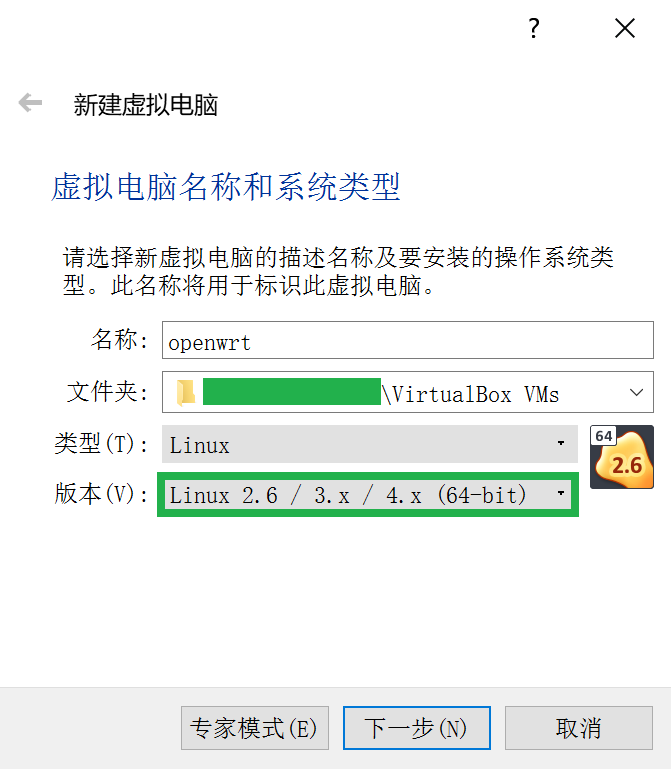
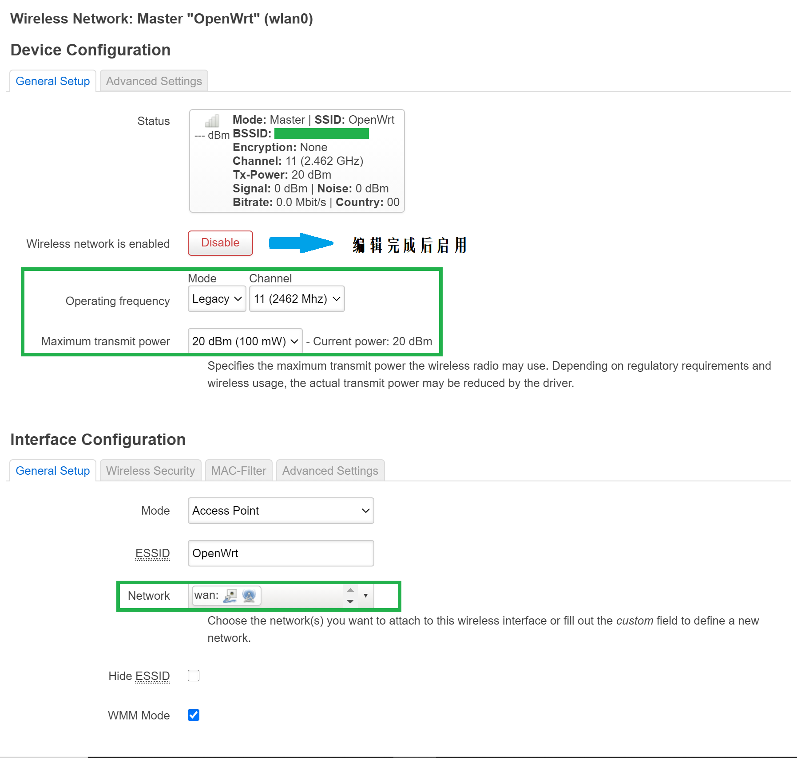
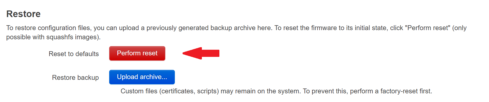

# Rep0x01 OpenWrt虚拟机搭建

### 1. 实验目的

- [x] 熟悉基于 OpenWrt 的无线接入点（AP）配置

- [x] 为第二章、第三章和第四章实验准备好「无线软 AP」环境

### 2. 实验要求

- [x] 对照[第一章实验说明文档](https://c4pr1c3.github.io/cuc-mis/chap0x01/exp.html)中`无线路由器/无线接入点（AP）配置`列的功能清单，找到在 OpenWrt 中的配置界面并截图证明；

- [x] 记录环境搭建步骤；

- [x] 如果 USB 无线网卡能在 OpenWrt 中正常工作，则截图证明；

    如果 USB 无线网卡不能在 OpenWrt 中正常工作，截图并分析可能的故障原因并给出可能的解决方法。

### 3. 实验环境

- 可以开启监听模式、AP 模式和数据帧注入功能的 USB 无线网卡 - Ralink 802.11n

- Virtualbox

- Kali - SMP Debian 5.7.6-1kali2 (2020-07-01) x86_64

- OpenWrt - 19.07.5 x86_64

### 4. 实验过程

- **复习VirtualBox的配置与使用**

    - 虚拟机镜像列表：`管理` -> `虚拟介质管理器`

        

    - 设置虚拟机和宿主机的文件共享，实现宿主机和虚拟机的双向文件共享：`虚拟机界面` -> `设备` -> `共享文件夹`

        

    - 虚拟机镜像备份和还原的方法

        - 备份：`虚拟机界面` -> `控制` -> `生成备份`

        - 还原：退出时选择需要恢复的备份，下次开机时自动恢复到指定界面

    - 熟悉虚拟机基本网络配置，了解不同联网模式的典型应用场景

        - 基本网络配置：略

        - [VirtualBox 虚拟机网络连接模式](https://www.jianshu.com/p/a85ba56d16ff)

- **OpenWrt 在 VirtualBox 上的安装与配置**

    - OpenWrt 的安装

        - 下载固件并解压缩[【Download Link】](https://downloads.openwrt.org/releases/19.07.5/targets/x86/64/openwrt-19.07.5-x86-64-combined-squashfs.img.gz)

        - 将 img 格式转换为 Virtualbox 虚拟硬盘格式 vdi

            ```
            # 镜像填充
            dd if=openwrt-x86-64-combined-squashfs.img of=openwrt.img bs=128000 conv=sync
            # 镜像格式转换
            VBoxManage convertfromraw --format VDI openwrt.img openwrt.vdi
            ```

        - 使用转换好的镜像文件新建虚拟机

            

            

            

        - 将镜像类型更改为多重加载

            

        - 虚拟磁盘扩容

            ```
            VBoxManage modifymedium disk --resize 10240 openwrt.vdi
            ```

            

        - 启用 USB 3.0 接口

            

        - 虚拟机网卡配置

            

            

        *（注：其他配置未修改）

        ```
        # 虚拟机默认设置如下：
        内存：1024MB（≥ 256MB）
        显存：16MB
        显卡控制器：VMSVGA
        ```

        **配置结果展示：**

        - 欢迎界面

            

        - 网络连通性检验

            

    - 虚拟机配置

        - OpenWrt 的管理接口配置

            ```
            # 指定网卡 lan 的 IP 地址用于 SSH 连接，便于后续操作（代码/指令的复制与粘贴）
            vi /etc/config/network
            # 重新加载 eth0 配置生效
            ifdown eth0 && ifup eth0
            # 安装 Luci 软件包与查看 USB 设备信息的工具
            opkg update && opkg install luci usbutils
            ```
            **/etc/config/network**

            ```
            config interface 'lan'
            option type 'bridge'
            option ifname 'eth0'
            option proto 'static'
            option ipaddr '192.168.56.82' 
            option netmask '255.255.255.0'
            option ip6assign '60'
            ```

            

        访问192.168.56.82查看 OpenWrt 的 Web 管理界面如下：

        

    - 开启 AP 功能

        - 安装无线网卡驱动

            ```
            opkg find kmod-* | grep 2870
            #kmod-rt2800-usb - 4.14.209+4.19.137-1-2 - Ralink Drivers for RT2x00 cards (RT2870 USB)
            opkg install kmod-rt2800-usb
            ```

            

            

            

        - 安装`wpa-supplicant`和`hostapd`，为 OpenWrt 提供更优的无线安全策略

            ```
            opkg install hostapd wpa-supplicant
            # 添加WPS按钮
            /etc/config/wireless
            # 初始化 WPS 进程
            hostapd_cli wps_pbc
            ```

            **/etc/config/wireless**
            ```
            # 添加如下指令在每一个 config 项目后
            option wps_pushbutton '1'
            ```

        - 在 Network -> Wireless 中 进行特殊配置并启用如下网络

            

            

            

- **无线路由器/无线接入点（AP）配置清单界面自查**

    - 重置和恢复AP到出厂默认设置状态

        

    - 设置AP的管理员用户名和密码

        
    
    - 设置SSID广播和非广播模式

        
    
    - 配置不同的加密方式

        

    - 设置AP管理密码

        

    - 配置无线路由器使用自定义的DNS解析服务器

        

    - 配置DHCP和禁用DHCP

        

        

    - 开启路由器/AP的日志记录功能（对指定事件记录）

        

    - 配置AP隔离(WLAN划分)功能

        
    
    - 设置MAC地址过滤规则（ACL地址过滤器）

        

    - 查看WPS功能的支持情况

        

    - 查看AP/无线路由器支持哪些工作模式

        

- **使用手机连接不同配置状态下的AP对比实验**

    手机连接 AP 后的界面如下：

    

    采用不同的加密方式获取到的数据包信息如下：

    （讲真没看出来有哪些明显的差别，蹲个分析方法qwq

    - [无加密](pcap/normal.pcapng)

    - [WPA-PSK(medium security)](pcap/medium-security.pcapng)

    - [WPA-PSK(strong secutity)](pcap/strong-security.pcapng)

- **使用路由器/AP的配置导出备份功能，尝试解码导出的配置文件**

    导出备份的界面如下所示：

    

    通过解压缩发现 AP 配置文件以明文形式存储，**十分拉跨** ，这里出于安全性考虑不上传导出的备份


### 5. 遇到的问题

- 报错：`VBoxManage: Command Not Found`

    **解决方法：** 将VirtualBox的安装路径添加至`系统环境变量`

- OpenWrt 下载包速度太慢

    **解决方法：**

    ```
    # 备份原始配置文件
    cp /etc/opkg/distfeeds.conf /etc/opkg/distfeeds.conf.bk
    # 安装 libustream-openssl/luci-ssl-openssl ca-bundle ca-certificates ，以启用HTTPS避免运营商缓存劫持
    # 替换镜像源
    sed -i 's/downloads.openwrt.org/mirrors.ustc.edu.cn\/openwrt/g' /etc/opkg/distfeeds.conf
    # 更新软件索引，检查是否出现错误
    opkg update
    ```

    （额……怎么说呢，换源了其实也没有快很多qwq

- 主机上插入了 USB 网卡但 Virtualbox 管理界面显示`没有连接USB设备`

    **问题原因：** 在安装 WireShark 的时候一起安装了 USBPcap ，使得 VirtualBox 的 USB 驱动失效

    **解决方法（可选）：** 
    
    - 重新安装/更新 VirtualBox

    - 删除USBPcap并手动安装驱动（右键单击Oracle\VirtualBox\drivers\USB\device\VBoxUSB.inf，再点击安装即可）

    **结果展示：**

    

- 执行`git clone https://github.com/brektrou/rtl8821CU.git`指令时出现报错信息如下：

    ```
    fatal: unable to find remote helper for 'https'
    ```

    **解决方法：** 将clone地址更改为`git://github.com/brektrou/rtl8821CU.git`

    

### 6. 参考资料

- [Solved: VBoxManage is not recognized — Roel Peters](https://www.roelpeters.be/vboxmanage-is-not-recognized-and-how-to-solve-it/)

- [OpenWrt on VirtualBox HowTo](https://openwrt.org/docs/guide-user/virtualization/virtualbox-vm#convert_openwrtimg_to_vbox_drive)

- [How to add more to Git Bash on Windows](https://gist.github.com/evanwill/0207876c3243bbb6863e65ec5dc3f058)

- [OpenWrt更换镜像源- 知乎](https://zhuanlan.zhihu.com/p/342893095)

- [Virtualbox not detecting USB devices on both Linux and Windows Guest OSs](https://superuser.com/questions/1407878/virtualbox-not-detecting-usb-devices-on-both-linux-and-windows-guest-oss)

- [OpenWrt Wiki - WPS Options](https://openwrt.org/docs/guide-user/network/wifi/basic?s[]=wi&s[]=fi&s[]=protected&s[]=setup#wps_options)