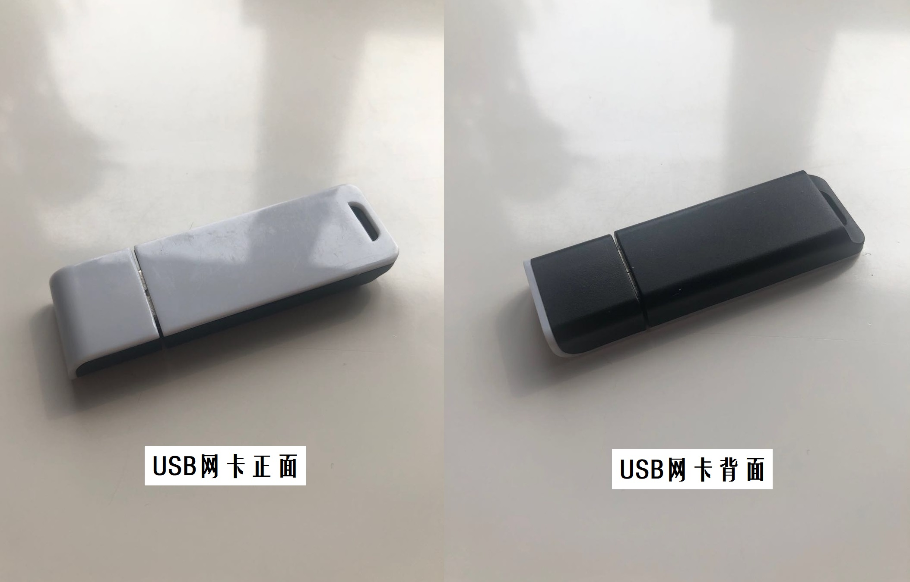

# Rep0x04 移动通信安全

### 1. 实验目的

- [x] 以WiFi协议为基础的物联网设备 `联网初始化配置` 分析

    *（注：没合适的设备且对 Bluetooth 协议更感兴趣，所以做的是与 Bluetooth 相关的实验）

- [x] 复现并利用 `CVE-2019-12272`

### 2. 实验环境

- 可以开启监听模式、AP 模式和数据帧注入功能的 USB 无线网卡

    - 小白杂牌

        

- Virtualbox - 6.1.18 r142142 (Qt5.6.2)

- OpenWrt - 15.05.1 x86_64

- Kali - SMP Debian 5.7.6-1kali2 (2020-07-01) x86_64

- Wireshark

### 3. 实验过程

- [Report 4.1 - 以 Bluetooth 协议为基础的物联网设备 “联网初始化配置” 分析](./report/report0x01.md)

- [Report 4.2 - CVE-2019-12272的复现与利用](./report/report0x02.md)