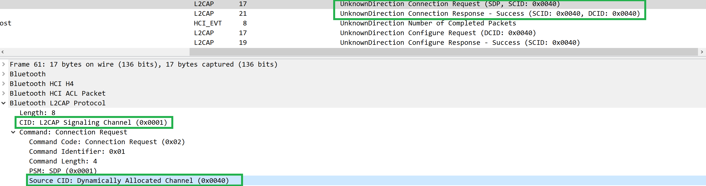
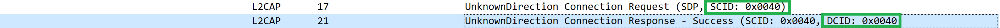
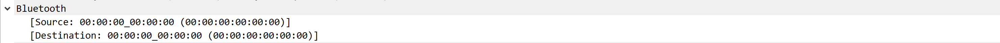

# Rep0x04(Part-1) 以Bluetooth协议为基础的物联网设备 “联网初始化配置” 分析

### 1. 实验过程

*（注：**做着玩**，因为对 Bluetooth 的相关协议不熟悉所以分析时难免存在错误）

- 对 `WireShark Official` 所[提供的.pcap文件](../pcap/tcpdumpBluetooth.pcap)的分析

    - Pairing phases

        - Phase-1

            1. 信道分配：
            
                0x0001信道用于发送 Connection Request；
                0x0040信道用于发送指定应用的配置文件以及设备通信（LE-Frame）

                

                

            2. 信道模式：Flow Control Mode（分析图同上）

            3. 通信双方（不知道是不是所有的都是这样，有点奇怪😲）

                

        - Phase-2 & Phase-3：没有在.pcap里找到proof

            > In phase two, the purpose is to generate a Short Term Key (STK). This is done with the devices agreeing on a Temporary Key (TK) mixed with some random numbers which gives them the STK. **The STK itself is never transmitted between devices**. With STK, this is commonly known as LE legacy pairing. However, if the Secure Connection Only Mode is being used, a Long Term Key (LTK) is generated at this phase (instead of an STK), and this is known as LE Secure Connections.

- 对自己抓到的.pcap文件的分析

    *（注：Reserved, if available）

### 2. 遇到的问题

- 不清楚 Bluetooth 的 Authentication 是否必须发送 `Bluetooth Security Manager Protocol`，我在WireShark官网找到的.pcap里没有此类信息，但看一个 blogger 对 Apple Watch 的分析中出现了这个

    

### 3. 参考资料

- [Wikipedia - AirPods](https://en.wikipedia.org/wiki/AirPods)

- [AirPods (2nd generation) - Technical Specifications - Apple](https://www.apple.com/airpods-2nd-generation/specs/)

- [Bluetooth - The Wireshark Wiki](https://wiki.wireshark.org/Bluetooth)

- [物联网无线技术蓝牙和WiFi的区别有哪些？ - 知乎](https://zhuanlan.zhihu.com/p/33329187)

- [Bluetooth - Authentication, Authorisation, Encryption](https://www.toengel.net/studium/mm_and_sec/bluetooth.pdf)

- [UNDERSTANDING BLUETOOTH SECURITY](https://duo.com/decipher/understanding-bluetooth-security)

- [Bluetooth (seven) L2CAP layer protocol analysis](https://www.programmersought.com/article/70332749356/)

- [Logical Link Control and Adaptation Layer Protocol (L2CAP)](http://software-dl.ti.com/simplelink/esd/simplelink_cc13x2_26x2_sdk/2.40.00.81/exports/docs/ble5stack/ble_user_guide/html/ble-stack-common/l2cap.html)

- [BLE L2CAP Frame Generation and Decoding](https://nl.mathworks.com/help/comm/ug/ble-l2cap-frame-generation-and-decoding.html;jsessionid=82e05b83c789a95de746e08d51b7)