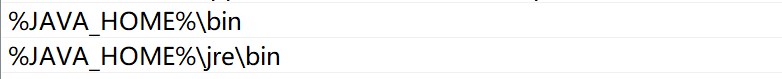
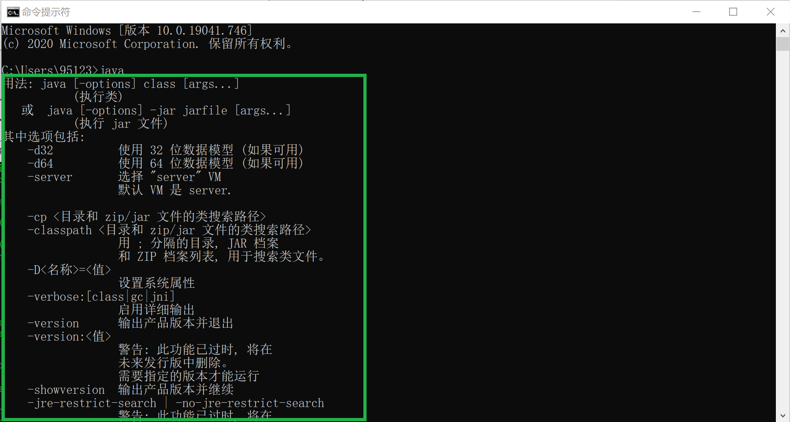
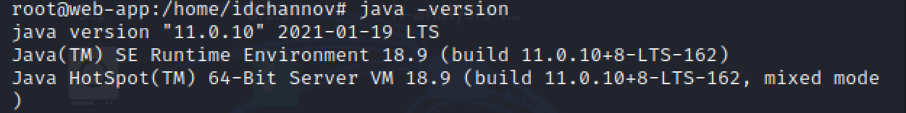
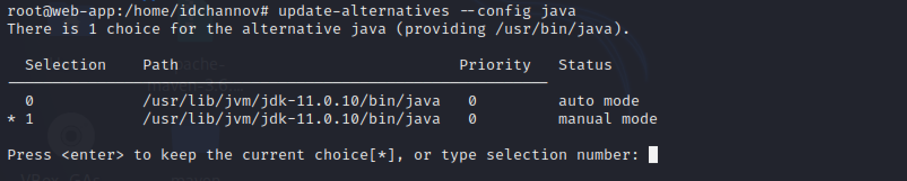
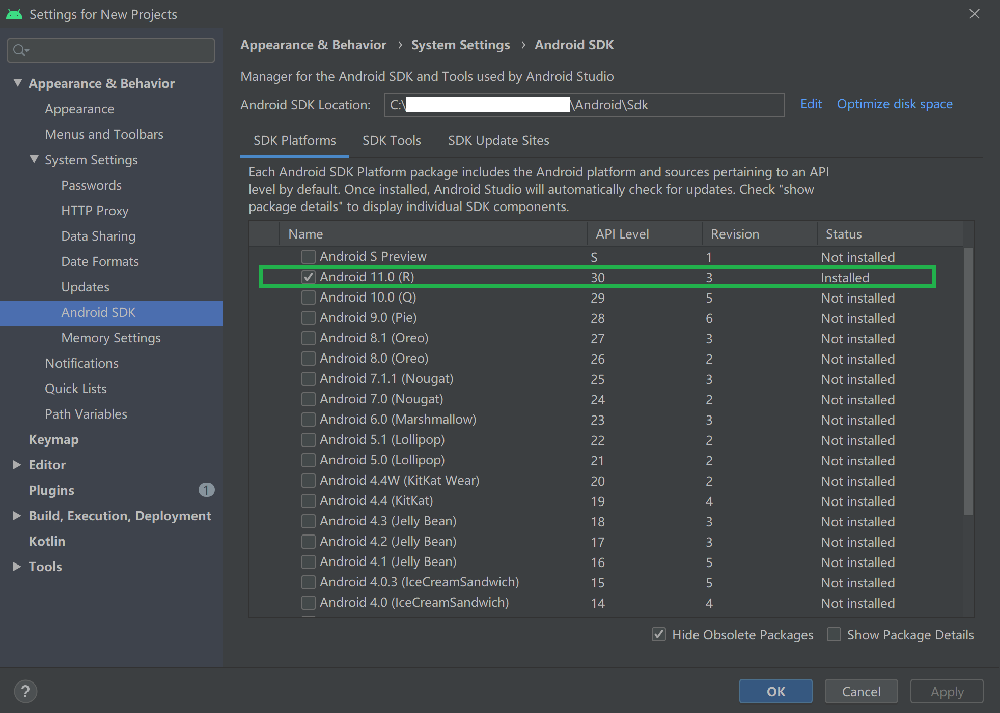
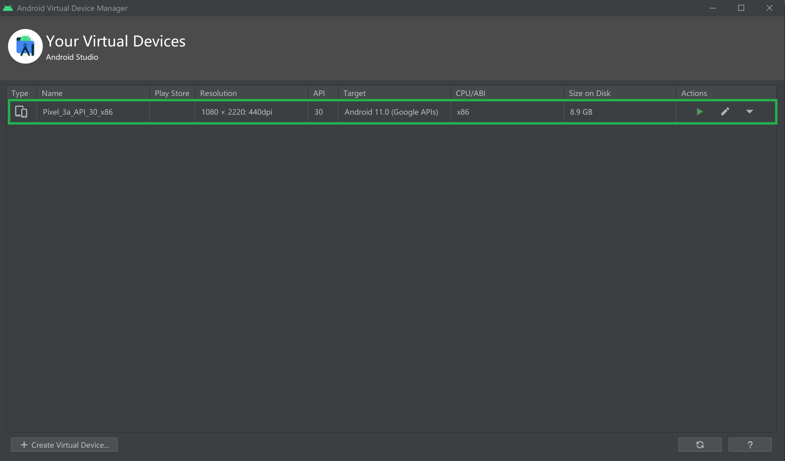
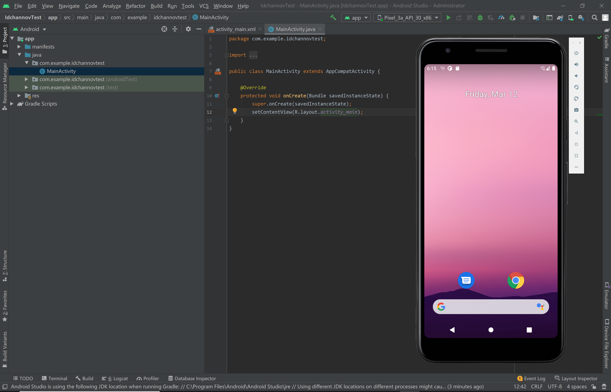
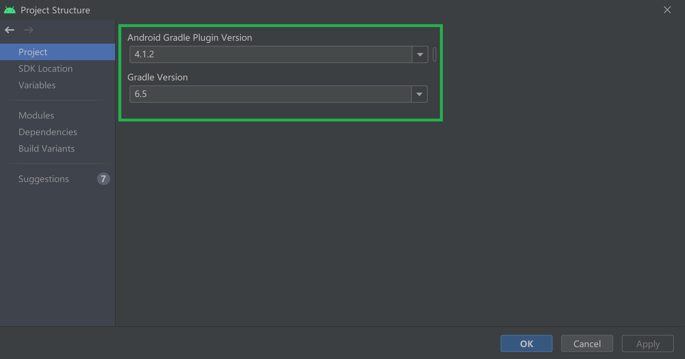
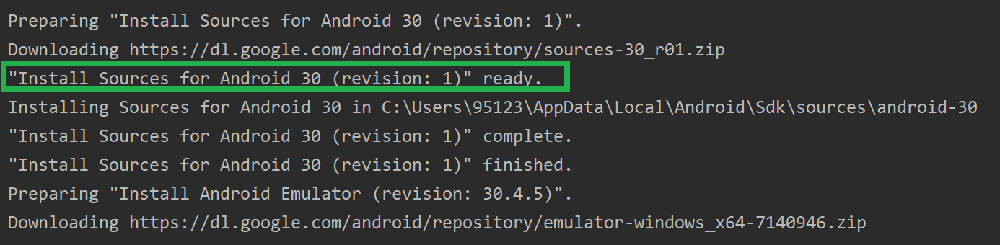

# Rep0x05 Android模拟器环境搭建

### 1. 实验要求

- [x] 安装和配置 Java SDK

- [x] 安装Android Studio

- [x] 下载安装 Android SDK

- [x] 配置 Android 模拟器运行环境

- [x] 配置 Gradle 编译环境

### 2. 实验环境

- Windows 10

- Kali - SMP Debian 5.7.6-1kali2 (2020-07-01) x86_64

- Java SE Development Kit 11

- Android Studio -  4.1.2 for Windows 64-bit


### 3. 实验过程

- **Java SDK的安装与配置**

    - *Windows ver.*

        - 下载并安装Java JDK [[Download Link]](https://www.oracle.com/java/technologies/javase-jdk11-downloads.html)

        - 配置环境变量

            1. 右键单击`此电脑` -> `属性` -> `高级系统设置` -> `环境变量`

            2. 新建JAVA_HOME变量，添加电脑上JDK安装的绝对路径

                

            3. 新建/修改 CLASSPATH 变量，添加变量如下

                

            4. 向PATH中添加变量如下

                

            5. 检验安装是否成功

                

    - *Kali ver.* (顺手附上🌼)

        ```cmd
        $ apt-get update && apt-get upgrade
        ## 安装Java JDK
        $ apt-get install default-jdk -y
        ## 确认Java版本
        $ java -version
        ## 查看Java JDK的安装位置
        update-alternatives --config java
        ## 添加环境变量
        $ vim /etc/environment
        ```

        

        

        **/etc/environment**

        ```
        PATH="/usr/local/sbin:/usr/local/bin:/usr/sbin:/usr/bin:/sbin:/bin:/usr/games:/usr/local/games:/usr/lib/jvm/jdk-11.0.10/bin"
        JAVA_HOME="/usr/lib/jvm/jdk-11.0.10"
        ```
- **Android模拟器环境配置**

    - 下载Android Studio [[Download Link]](https://developer.android.com/studio)

    - 下载并安装 Android SDK
        
        *（注：默认安装Android 11.0 (R)，可根据个人需求选择安装版本）

        

    - 配置 Android 模拟器运行环境

        1. 安装Intel x86 Emulator Accelerator (HAXM installer)

        2. 创建AVD（根据应用需求）

            

        模拟器运行情况如下(应用初始硬件配置))：

        

    - Gradle 编译环境

        - Android Studio内置Gradle及其插件版本信息

            

### 4. 遇到的问题

- 下载安装包时由于响应超时导致安装失败，报错信息如下：

    ```
    Preparing "Install Sources for Android 30 (revision: 1)".
    Downloading https://dl.google.com/android/repository/sources-30_r01.zip
    java.net.SocketTimeoutException: Read timed out
    Warning: An error occurred while preparing SDK package Sources for Android 30: Read timed out.
    "Install Sources for Android 30 (revision: 1)" failed.
    ```

    **解决方法：**

    根据`详细信息`中提供的网址下载相应文件，并将其放入`%INSTALL_PATH%/Android/Sdk/.temp/PackageOperation04`目录下

    **结果展示：**

    

    *（注：此处为举例说明，此类问题都可采用这种方法解决）

### 5. 参考资料

- [Oracle Java SE Support Roadmap](https://www.oracle.com/java/technologies/java-se-support-roadmap.html)

- [How To Install Java with Apt-Get on Debian 8](https://www.digitalocean.com/community/tutorials/how-to-install-java-with-apt-get-on-debian-8)

- [Android Studio - 创建和管理虚拟设备](https://developer.android.com/studio/run/managing-avds#createavd)

