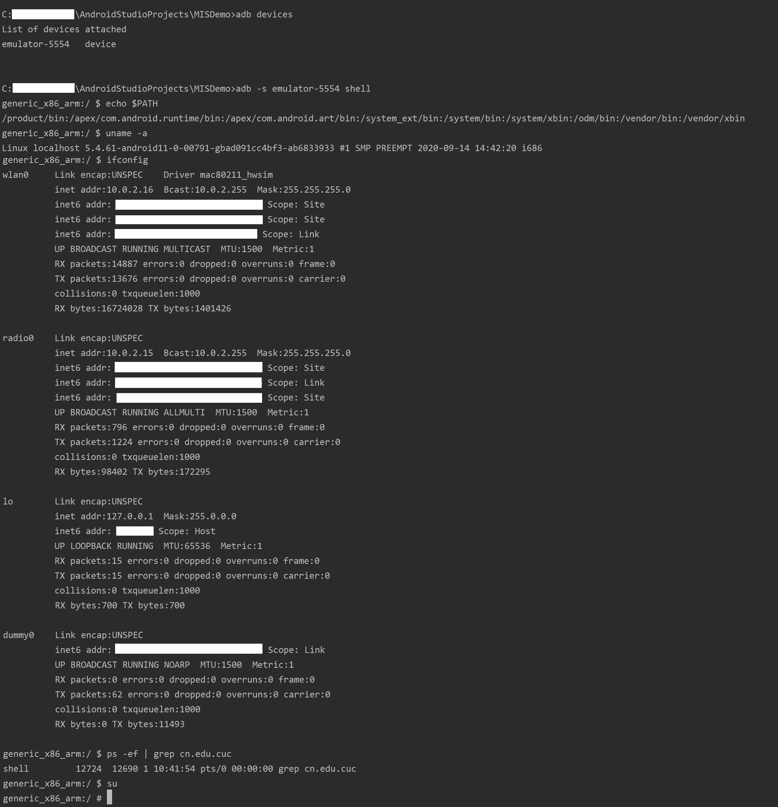
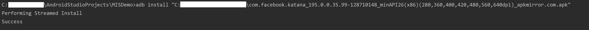
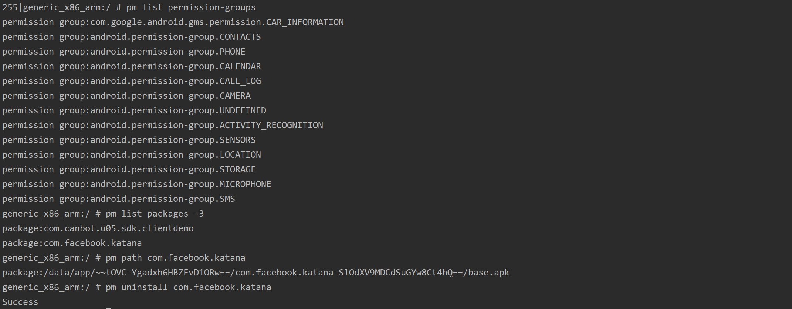
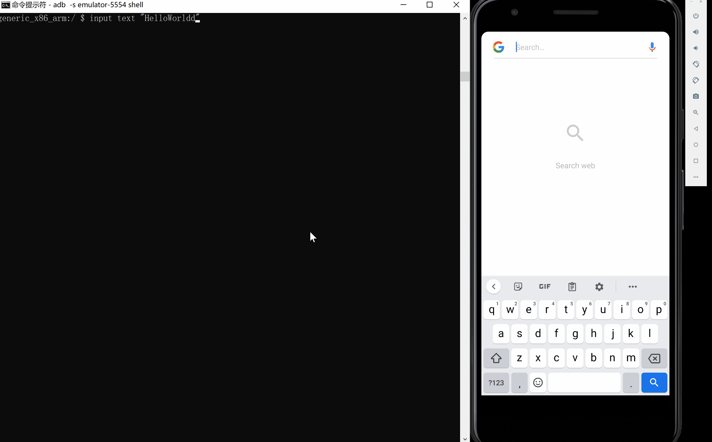
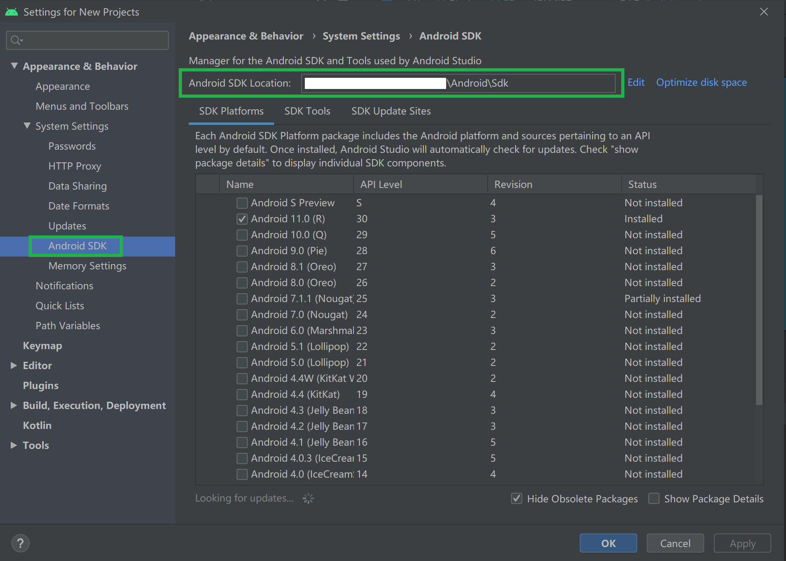
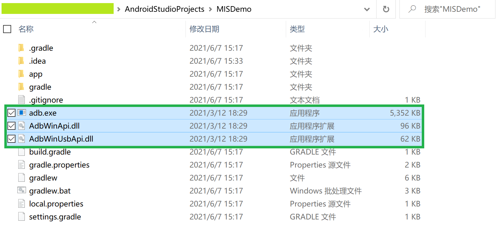
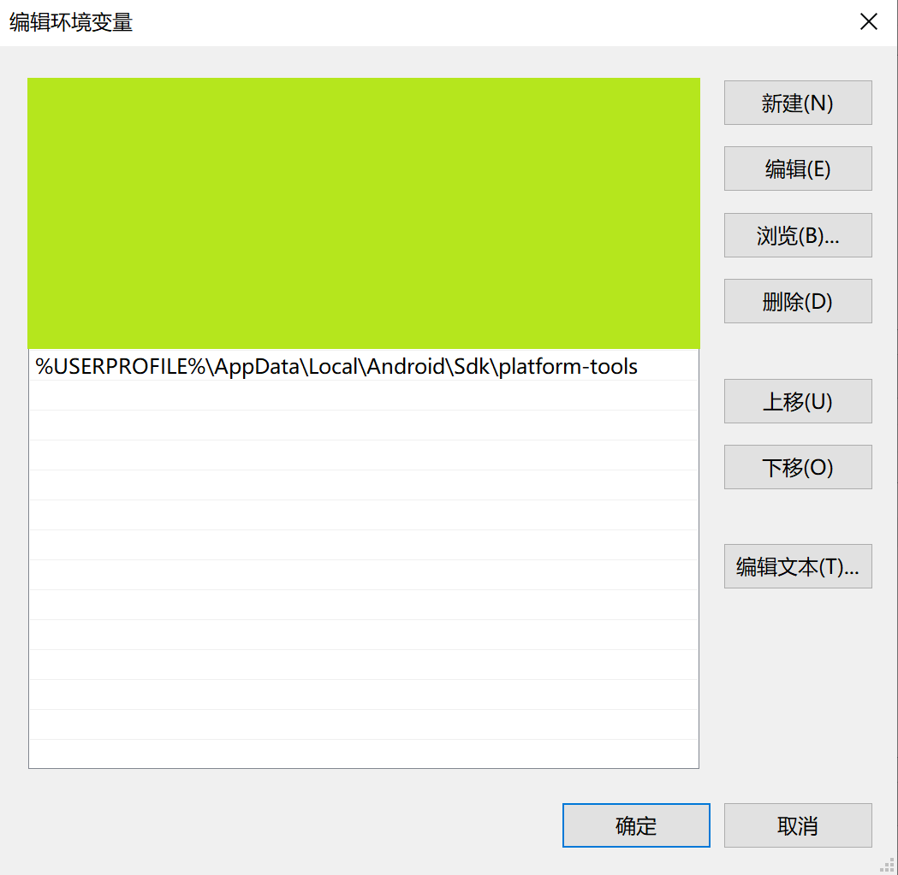
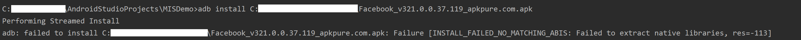

# ADB 实验

### 1. 实验过程

- **命令行**

    ```
    # 列出当前和计算机连接的 Android 设备或者模拟器的装置识别码
    C:\> adb devices
    # 将 Android 设备文件复制到本地
    C:\> adb pull REMOTE_PATH LOCAL_PATH
    # 将本地文件上传到 Android 设备
    C:\> adb push LOCAL_PATH REMOTE_PATH
    # 安装应用
    C:\> adb install PATH_TO_APK

    # 进入模拟器环境 ( Linux )
    C:\> adb -s emulator-xxxx shell
    # 【注】进入模拟器环境后可执行 Linux 系统的指令，以下仅为示例
    # 输出环境变量
    $ echo $PATH
    # 查看操作系统版本
    $ uname -a
    # 查看本机网络配置信息
    $ ifconfig
    # 搜索应用进程
    $ ps -ef | grep cn.edu.cuc
    # 获取 root 权限
    $ su
    ```

    

    

    

    

    

- **Activity Manager (am)**

    ```
    # Camera（照相机）的启动方法为：
    $ am start -a android.media.action.STILL_IMAGE_CAMERA 

    # 启动默认 Google 浏览器的方法为：
    $ am start -n com.android.chrome/com.google.android.apps.chrome.Main

    # 启动浏览器浏览指定网页的方法为：
    $ am start -a android.intent.action.VIEW -d http://www.zhihu.com

    # 拨打电话的方法为：
    $ am start -a android.intent.action.CALL -d tel:10086

    # 发短信的方法为：
    $ am start -a android.intent.action.SENDTO -d sms:10086 --es sms_body "This is idchannov" --ez exit_on_sent true
    ```

    

- **软件包管理器 (pm)**

    ```
    # 使用方法为：pm command
    # 【注】以下为示例

    # 获取所有已知权限组
    $ pm list permission-groups
    # 查看第三方软件包
    $ pm list packages -3
    # 查看软件包的安装路径
    $ pm path PACKAGE_NAME
    # 卸载指定软件包
    $ pm uninstall PACKAGE_NAME
    ```

    

- **其他 ADB 实验 - 以 Google 浏览器为例的 ADB Key Command**

    ```
    # 输入文本 "HelloWorldd"
    input text "HelloWorldd"
    # 删除多余字符
    input keyevent KEYCODE_DEL
    # 回车键查询
    input keyevent KEYCODE_ENTER
    # 物理 HOME 键
    adb shell input keyevent KEYCODE_HOME
    ```

    

### 2. 遇到的问题

- 在命令行输入命令 `adb xxx` 显示如下报错信息：

    

    **解决方法：**

    - *方法一*

        - 打开 `Tools` -> `SDK Manager` 查看 Android SDK 的安装路径

            

        - 在 Android SDK 下的 `platform-tools` 子目录找到 `adb.exe` 、 `AdbWinApi.dll` 及 `AdbWinUsbApi.dll`，并将之复制到命令行的 **启动目录** 下

            

    - *方法二*

        - 点击 `开始菜单` -> `查看高级系统设置` -> `环境变量`

        - 在系统环境变量中添加 `%USERPROFILE%\AppData\Local\Android\Sdk\platform-tools`

            

    **效果展示：**

    

    

- 在终端安装应用时出现如下报错信息：

    

    **错误原因：** 安装版本错误，下载 x86 版本的 .apk 文件即可


### 3. 参考资料

- [Android Debug Bridge (adb)](https://docs.microsoft.com/zh-tw/dual-screen/android/emulator/adb)

- [Using ADB and fastboot](https://wiki.lineageos.org/adb_fastboot_guide.html)

- [Open camera with ADB](https://www.cnblogs.com/soc-linux-driver/p/4097885.html)

- [Open Crome with ADB](https://stackoverflow.com/questions/28150650/open-chrome-with-adb)

- [KeyEvent | Android Developers](https://developer.android.com/reference/android/view/KeyEvent)