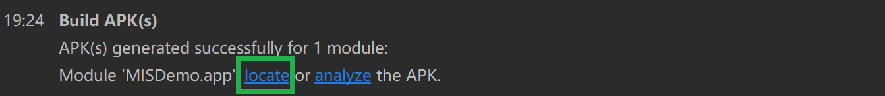

# Hello World 系列实验

### 1. 实验过程

- **Hello World v1**

    - 按照 [Android Developers | Create an Android project](https://developer.android.google.cn/training/basics/firstapp) 根据实验要求创建空项目

        


    - 按照 [Android Developers | Build a simple user interface](https://developer.android.com/training/basics/firstapp/building-ui) 创建所需布局

        

        

    - 按照 [Android Developers | Start another activity](https://developer.android.com/training/basics/firstapp/starting-activity#java) 编写代码

    - 在编辑界面指定使用的模拟器

        

    - 试运行 APP

        
        
        

- **Hello World v2**

    - 使用 [CUC MIS GitBook | Chap0x06](https://c4pr1c3.github.io/cuc-mis/chap0x06/exp.html) 提供的代码对 `MainActivity.java` 及 `DisplayMessageActivity.java` 进行替换

    - 根据以上代码对 `DisplayMessageActivity` 的布局更改如下：

        

    - 试运行 APP

        

- **Q & A**

    - **Hello World v1**

        - 按照向导创建的工程在模拟器里运行成功的前提下，生成的 APK 文件在哪儿保存的？

            **【ANS】** `%USERPROFILE%\AndroidStudioProjects\MISDemo\app\build\outputs\apk\debug`

            - *Windows*

                

            - *Android Emulator*

                

        - 使用 adb shell 是否可以绕过 MainActivity 页面直接“唤起”第二个 DisplayMessageActivity 页面？是否可以在直接唤起的这个 DisplayMessageActivity 页面上显示自定义的一段文字，比如：“你好移动互联网安全”

            **【ANS】** 1）是；2）是

            ```
            $ am start -n cn.edu.cuc/.DisplayMessageActivity --es "cn.edu.cuc.mishello.MESSAGE" SELF_DEFINED_TEXT
            ```

            

        - 如何实现在真机上运行你开发的这个Hello World程序？

            **【ANS】** 

            *（注：由于无 Android 真机，因此参考 [Android Developers | Run your app](https://developer.android.com/training/basics/firstapp/running-app) 完成问答）

            按照以下步骤设置真机：

            -  使用一根 USB 线将设备连接到开发机器。如果应用程序是在 Windows 上开发的，则可能需要为设备[安装合适的 USB 驱动程序](https://developer.android.com/studio/run/oem-usb?hl=zh-cn);

            - 执行以下步骤，在开发者选项窗口中启用 USB 调试：

                1. 打开 **设置** 应用；

                2. 如果设备使用 Android v8.0 或更高版本则选择 **系统** 。否则，继续执行下一步；

                3. 滚动到底部，然后选择 **关于手机** ；

                4. 滚动到底部，然后点按 **版本号** 七次；

                5. 返回上一屏幕，滚动到底部，然后点按 **开发者** 选项；

                6. 在 **开发者选项** 窗口中，向下滚动以查找并启用 **USB 调试** 。

            按照以下步骤操作，在设备上运行应用：

            - 在 Android Studio 中，从工具栏中的运行/调试配置下拉菜单中选择需要运行的应用

            - 在工具栏中，从目标设备下拉菜单中选择要用来运行应用的设备

                

            - 点击 `Run`

        - 如何修改代码实现通过 `adb shell am start -a android.intent.action.VIEW -d http://sec.cuc.edu.cn/` 让cn.edu.cuc.misdemo程序出现在“用于打开浏览器的应用程序选择列表”？

            **【ANS】** 在 `AndroidManifest.xml` 的 `<intent-filter></intent-filter>` 间配置 URI Scheme，如下所示：

            ```
            // 注：事实上任何以 http 方式访问的网页都会在浏览器中弹出题示「应用程序选择列表」
            <action android:name="android.intent.action.VIEW" />
            <category android:name="android.intent.category.DEFAULT" />
            <category android:name="android.intent.category.BROWSABLE" />
            <data android:scheme="http" />
            ```

            

        - 如何修改应用程序默认图标？

            **【ANS】** 

            1. 右键单击 `app` -> `New` -> `Image ` -> `Image Asset`，根据需求制定 APP icon

                

            2. 在 `AndroidManifest.xml` 中修改与图标相关的内容

                

            

        - 如何修改代码使得应用程序图标在手机主屏幕上实现隐藏？

            **【ANS】** 

            在 `AndroidManifest.xml` 中做出如下修改即可：

            ```
            <intent-filter>
                <action android:name="android.intent.action.MAIN" />

                // [-] <category android:name="android.intent.category.LAUNCHER" />
                <category android:name="android.intent.category.LEANBACK_LAUNCHER"/>
            </intent-filter>
            ```

            

    - **Hello World v2**

        - DisplayMessageActivity.java中的2行打印日志语句是否有风险？如果有风险，请给出漏洞利用示范。如果没有风险，请给出理由

            **【ANS】** 
            
            - 若没有将日志保存至本地则无风险，因为 `log.d()` 仅作用于调试时输出日志
            
            - 若使用 `adb logcat -d > <path-where-you-want-to-save-file>/filename.txt` 指令保存调试日志则存在一定风险：
            
                1. `message` 相当于 **明文传输** ，对敏感信息不友好
                 
                2. `secret_key` 可以帮助攻击者更快的缩小加密算法范围

            

        - SharedPreferences类在进行读写操作时设置的Context.MODE_PRIVATE参数有何作用和意义？还有其他可选参数取值吗？

            **【ANS】** 

            1. 关于 `MODE_PRIVATE`：

            > File creation mode: the default mode, where the created file can only be accessed by the calling application (or all applications sharing the same user ID).
            >
            > Constant Value: 0 (0x00000000)

            2. 其他参数

                a. `MODE_APPEND`

                > File creation mode: for use with openFileOutput(String, int), if the file already exists then write data to the end of the existing file instead of erasing it. 
                >
                > Constant Value: 32768 (0x00008000)

                b. `MODE_ENABLE_WRITE_AHEAD_LOGGING`

                > Database open flag: when set, the database is opened with write-ahead logging enabled by default.
                > 
                > Constant Value: 8 (0x00000008)

                c. `MODE_MULTIPROCESS`

                > SharedPreference loading flag: when set, the file on disk will be checked for modification even if the shared preferences instance is already loaded in this process. This behavior is sometimes desired in cases where the application has multiple processes, all writing to the same SharedPreferences file. Generally there are better forms of communication between processes, though.
                >
                > This was the legacy (but undocumented) behavior in and before Gingerbread (Android 2.3) and this flag is implied when targeting such releases. For applications targeting SDK versions greater than Android 2.3, this flag must be explicitly set if desired.
                > 
                > Constant Value: 4 (0x00000004)

                d. `MODE_NO_LOCALIZED_COLLATORS`

                > Database open flag: when set, the database is opened without support for localized collators.
                > 
                > Constant Value: 16 (0x00000010)

                a. `MODE_WORLD_READABLE`

                > File creation mode: allow all other applications to have read access to the created file.
                >
                > Starting from Build.VERSION_CODES.N, attempting to use this mode throws a SecurityException.
                >
                > Constant Value: 1 (0x00000001)

                b. `MODE_WORLD_WRITABLE`

                > File creation mode: allow all other applications to have write access to the created file.
                > 
                > Starting from Build.VERSION_CODES.N, attempting to use this mode will throw a SecurityException.
                >
                > Constant Value: 2 (0x00000002)


### 2. 遇到的问题

- 关于 Android IDE - `Auto Import` 的设置问题

    **解决方法：** 在 `File` -> `Settings` 中按需设置即可

    

### 3. 参考资料

- [Android Developers | Create an Android project](https://developer.android.google.cn/training/basics/firstapp)

- [Android Developers | Build a simple user interface](https://developer.android.com/training/basics/firstapp/building-ui)

- [Android Developers | Start another activity](https://developer.android.com/training/basics/firstapp/starting-activity#java)

- [Android Developers | Run your app](https://developer.android.com/training/basics/firstapp/running-app)

- [关于ide：在Android Studio中自动导入所有内容的快捷方式是什么？](https://www.codenong.com/16615038/)

- [How to send String[] intent extra value from command line?](https://stackoverflow.com/questions/19769716/how-to-send-string-intent-extra-value-from-command-line)

- [How to Open an Android App from the Browser](https://blog.branch.io/how-to-open-an-android-app-from-the-browser/)

- [How do you change the launcher logo of an app in Android Studio?](https://stackoverflow.com/questions/26615889/how-do-you-change-the-launcher-logo-of-an-app-in-android-studio)

- [Android hide/unhide app icon programmatically](https://stackoverflow.com/questions/19114439/android-hide-unhide-app-icon-programmatically)

- [菜鸟教程 | View与ViewGroup的概念](https://www.runoob.com/w3cnote/android-tutorial-view-viewgroup-intro.html)

- [Android Developers | String resources](https://developer.android.com/guide/topics/resources/string-resource)

- [Android Developers | Optimizing Layout Hierarchies](https://developer.android.com/training/improving-layouts/optimizing-layout)

- [View.findViewById是深度优先的](https://segmentfault.com/a/1190000014636827)

- [ANdroid Developers | Log](https://developer.android.com/reference/android/util/Log)

- [How to save LogCat contents to file?](https://stackoverflow.com/questions/8264645/how-to-save-logcat-contents-to-file)

- [Android Developers | Context](https://developer.android.com/reference/android/content/Context)