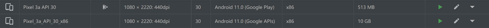

# Rep0x07 软件逆向系列实验

### 1. 实验目的

- 熟悉 Android 终端应用逆向分析的相关知识及操作

### 2. 实验要求

- [x] 使用 apktool 反汇编上一章实验中我们开发的 Hello World v2 版程序，对比 Java 源代码和 smali 汇编代码之间的一一对应关系

- [x] 对 Hello World v2 版程序生成的 APK 文件进行程序图标替换，并进行重打包，要求可以安装到一台未安装过 Hello World v2 版程序的 Android 模拟器中

- [x] 尝试安装重打包版 Hello World v2 到一台已经安装过原版 Hello World v2 程序的模拟器中，观察出错信息并解释原因

- [x] 去掉 Hello World v2 版程序中 DisplayMessageActivity.java 代码中的那2行日志打印语句后编译出一个新的 APK 文件，假设文件名是：misdemo-v3.apk，尝试使用课件中介绍的几种软件逆向分析方法来破解我们的认证算法

### 3. 实验环境

- Android Studio 4.1.2

    - `Pixel 3a API 30 x86` - Android 11.0 x86 (Google APIs)

    - `Pixel 3a` -  Android 11.0 x86 (Google Play)

    

### 4. 实验过程

- [Report 7.1 - Android 自动化反编译实验](report/report0x01.md)

- [Report 7.2 - 注册序列号算法破解实验](report/report0x02.md)