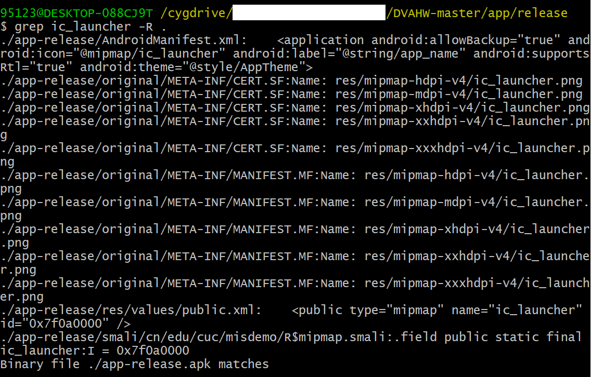
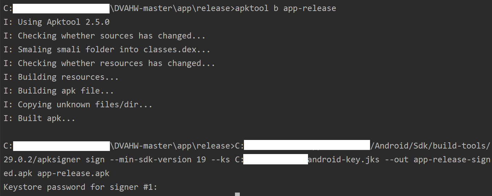
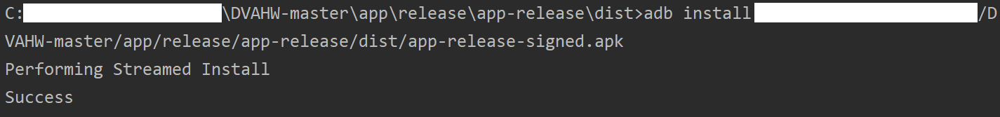
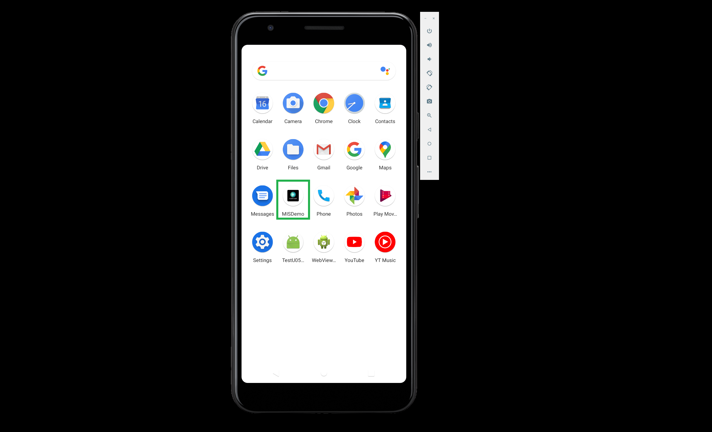
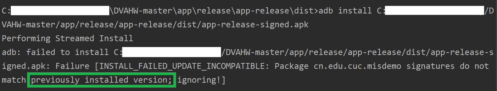

# Android 自动化反编译实验

### 1. 实验过程

- **Smali代码分析**

    *（注：该实验报告以 `DisplayMessageActivity-1.smali` 为例解析 Smali 代码）

    [【View Full Code with Detailed Comments】](../smali/DisplayMessageActivity-1.smali)

- **APK 重打包实验**

    - 修改源代码增加打印语句

        【详见】 [Report 7.2 - 注册序列号算法破解实验](report/report0x02.md) -> 实验过程 -> 可能的破解思路-2

    - 进行图标替换

        - *方法一：* 使用对用户友好的 GUI 工具，如：

            - [APK Editor Studio](https://qwertycube.com/apk-editor-studio/)

            - [APK Icon Editor](https://qwertycube.com/apk-icon-editor/)

            - [APKManager](http://forum.xda-developers.com/showthread.php?t=695701)

        - *方法二：* 将自己 DIY 的 Image Asset 复制到 `app/release/app-release/res/` 下并重命名为 `ic_launcher.png` / `ic_launcher_xxx.png`

            

            

            

            

    - 尝试安装重打包版应用到一台已经安装过原版应用的模拟器中，观察出错信息并解释原因

        【详见】 [Report 7.2 - 注册序列号算法破解实验](report/report0x02.md) -> 遇到的问题 -> Q3

    - 尝试安装重打包版应用到一台未安装过原版应用的模拟器中，观察出错信息并解释原因

        

        **错误原因：** 从 Android Studio 启动模拟器时已经安装了一次 APP，因此需要 `卸载` -> `重新安装` 方可正常使用

### 2. 参考资料

- [Getting started with Smali](https://www.programmersought.com/article/47366047486/)

- [Smali 语法中文版](https://www.cnblogs.com/liweis/p/4653496.html)

- [【技术分享】Android apk反编译：Smali语法入门教程](https://www.anquanke.com/post/id/85035)