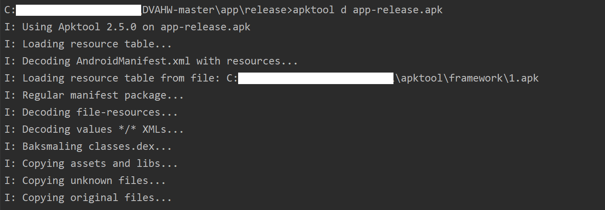

# 注册序列号算法破解实验

### 1. 实验过程

- 在 Android Studio 中导入 [DVAHW (Prod by. Hwang)](https://github.com/c4pr1c3/DVAHW)

- 打包 APK

    - Nav. `Build` -> `Generate Signed Bundle / APK...`

        

        

    - 若需新建 KeyStore 文件则 `Create New...` -> Customize KeyStore Settings

        

    

- 安装 apktool

    - 下载 [wrapper script](https://raw.githubusercontent.com/iBotPeaches/Apktool/master/scripts/windows/apktool.bat) 和 [apktool-2](https://bitbucket.org/iBotPeaches/apktool/downloads/)

    - 将下载的 .jar 文件重命名为 `apktools.jar`

    - 将 `apktools.jar` 和 `apktools.bat` 置于 `C://Windows` 目录下

- 使用 apktool 对 MISDemo 进行反编译

    ```
    // PRE-1. 切换至 app-release.apk 所在目录
    // PRE-2. 确认 apktool 在系统 PATH 环境变量中可找到
    C:\> apktool d app-release.apk
    ```

    

    

    

- 逆向分析

    - 根据应用行为 Output:`注册失败` 在反汇编输出目录下进行关键字查找，找到该关键字的注册变量名

        ```
        C:\> grep '注册失败' -R . 
        ```

    - 打开 `app/release/app-release/res/values/strings.xml`，找到应用输出的关键信息，找到使应用实现 Output:`注册成功` 的突破口

        

    - 在反汇编输出目录下查找关键字 `register_ok`，发现 `register_ok` 的唯一资源标识符 `0x7f0b0025`

        ```
        C:\> grep 'register_ok' -R .
        ```

    - 在反汇编输出目录下查找 `0x7f0b0025`，定位关键代码 `DisplayMessageActivity.smali`

        ```
        C:\> grep '0x7f0b0025' -R .
        ```

    

    - 通过 [分析 DisplayMessageActivity.smali](report0x01.md)，总结该应用可能的破解思路如下：

        - 改变原来的注册码相等条件判断语句，对布尔类型返回结果直接取反，达到：只要我们没有输入正确的验证码，就能通过验证的“破解”效果 [【View Code】](../smali/DisplayMessageActivity-1.smali)
        
            1. 将 `if-eqz` 修改为 `if-nez`

                

            2. 重打包

                ```
                C:\> apktool b app-release
                ```

                

            3. 重签名

                ```
                C:\> cd app-release/dist/
                C:> <Android SDK Path>/build-tools/<valid version code>/apksigner sign --min-sdk-version 19 --ks <path to release.keystore.jks> --out app-release-signed.apk app-release.apk
                ```

                

            **破解效果预览：**

            

        - 在执行注册码相等条件判断语句之前，打印出用于和用户输入的注册码进行比较的“正确验证码”变量的值，借助 `adb logcat` 直接“偷窥”到正确的验证码 [【View Code】](../smali/DisplayMessageActivity-2.smali)

            ```
            // 在 .line 35 前添加如下代码
            const-string v2, "user input"

            .line 32
            invoke-static {v2, v0}, Landroid/util/Log;->d(Ljava/lang/String;Ljava/lang/String;)I

            const-string v2, "debug secret_key"

            .line 33
            invoke-static {v2, v1}, Landroid/util/Log;->d(Ljava/lang/String;Ljava/lang/String;)I
            ```

            该段代码可实现的效果如下：

            

            **破解效果预览：**

            

### 2. 遇到的问题

- 导入 DVAHW 后编译时出现如下报错信息

    

    **错误原因：** Android Studio 版本与该代码编译文件中的信息不适配

    **解决方法：** 在 `build.gradle` 中做出如下修改

    ```
    buildscript {
        dependencies {
            classpath 'com.android.tools.build:gradle:x.x.x'
            // x.x.x - The version of your installed Android Studio
        }
    }
    ```

- 发布应用时出现如下报错信息

    

    **解决方法：**

    - 在 `app` -> `build` -> `reports` 中定位报错原因，这里为 `TargetSdkVersion No Longer Supported`

        

    - 在 build.bundle 中修改 SDK 版本即可

        

    **结果展示：**

    

- 安装重签名后的应用时出现如下报错信息

    

    **错误原因：** Android R+不再允许应用压缩resource.asrc了

    **解决方法：** 修改 `compileSdkVersion`、`targetSdkVersion` 后再 重新发布 -> 逆向 -> 重打包 -> 重签名
    
    *（注：这个方法虽然笨拙但 **有用** ，网上搜了很多解决方法都没有起到实际效果，希望可以蹲到一个解答）

    **结果展示：**

    

### 3. 参考资料

- [Lint found fatal errors while assembling a release target | StackOverflow](https://stackoverflow.com/questions/50739996/lint-found-fatal-errors-while-assembling-a-release-target/51363161)

- [Install Instructions | APKTOOL](https://ibotpeaches.github.io/Apktool/install/)

- [How to use UNIX command on Windows](https://superuser.com/questions/1115407/grep-is-not-recognized-as-an-internal-or-external-in-windows)
