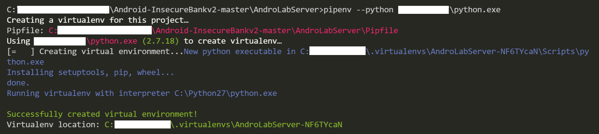
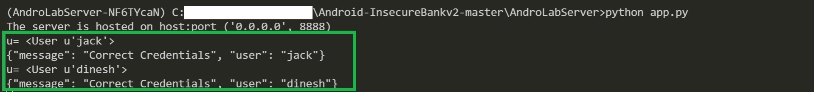
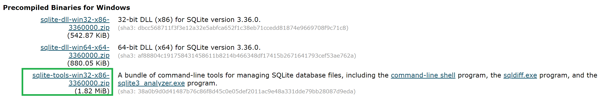

# Preparations before HACKING

### 1. 实验过程

- **在本地安装并运行 AndroLab Server 后端**

    - 下载 [InsecureBankv2](https://github.com/c4pr1c3/Android-InsecureBankv2) 的安装包

    - 在 [Python Official](https://www.python.org/downloads/) 上下载指定版本的（Python2）安装文件

        *（注：这里是由于本机没有 Python2 所以进行了安装，若有可直接跳过）

    - 在 Project 目录下创建 Python2 虚拟环境

        ```
        # 切换到 AndroLabServer 后端目录下
        C:> cd AndroLabServer
        C:> pipenv --python path\to\python
        ```

        

    - 安装依赖包

        ```
        # 激活 Python2 虚拟环境
        C:> pipenv shell
        # 安装依赖包
        C:> pipenv install
        ```

    - 运行 AndroLab Server 后端

        ```
        # 默认启用 192.168.58.1:8888，可指定 host 与 port
        C:> python app.py
        ```

        

- **在模拟器上安装 InsecureBankv2**

    ```
    # 项目根目录下
    adb install InsecureBankv2.apk
    ```

    

    后端与移动端网络连通性检验:

    ```
    Default (Account, Password):
    1. dinesh/Dinesh@123$ 
    2. jack/Jack@123$
    ```

    

    

- **下载 SQLite** [【Download Link】](https://www.sqlite.org/2021/sqlite-tools-win32-x86-3360000.zip)

    

### 2. 参考资料

- [Android InsecureBankv2 Usage Guide](https://github.com/dineshshetty/Android-InsecureBankv2/blob/master/Usage%20Guide.pdf)

- [pipenv使用指南](https://crazygit.wiseturtles.com/2018/01/08/pipenv-tour/)