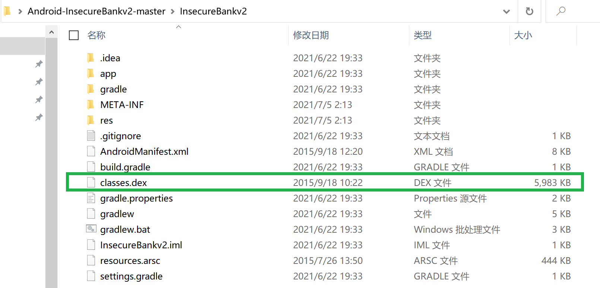
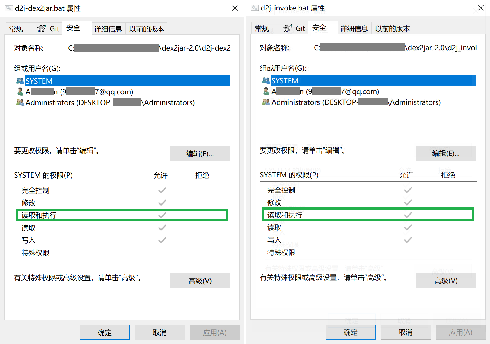
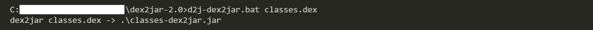
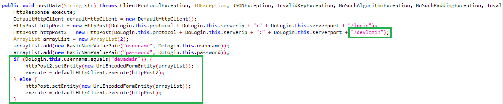
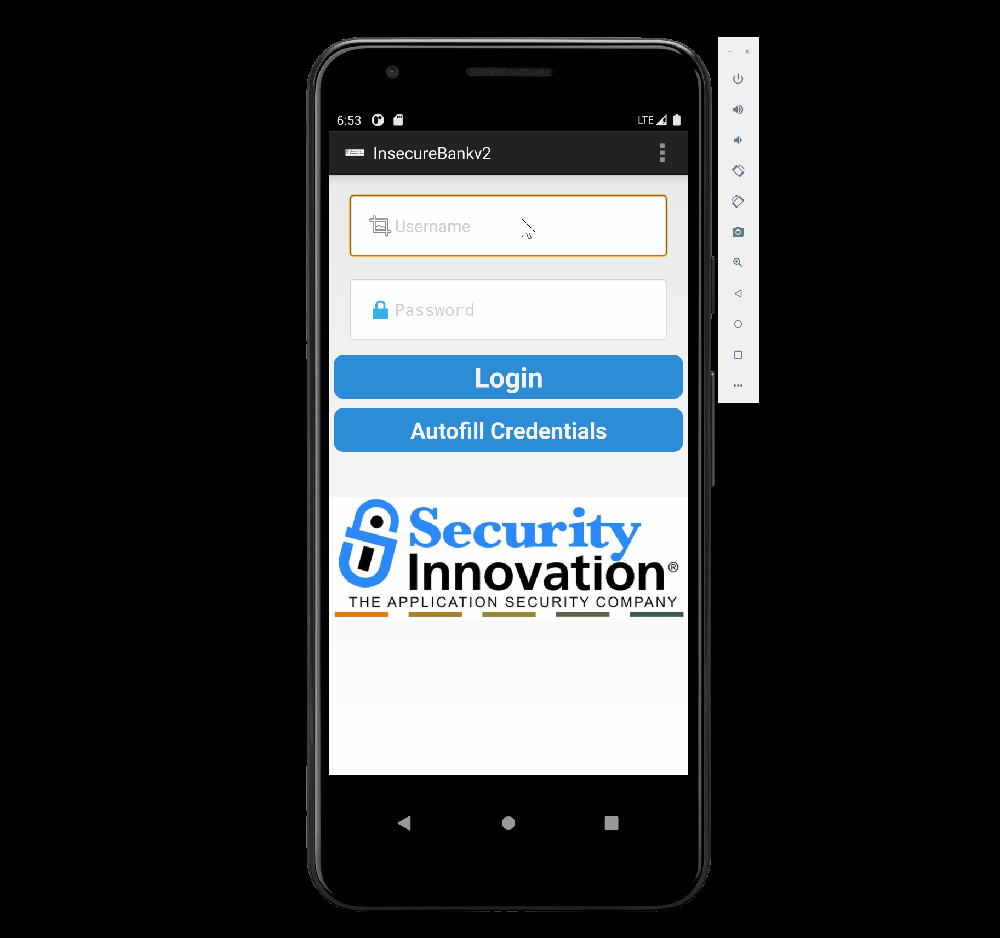

# Developer Backdoors

### 1. 实验过程

- 解压缩 `InsecureBankv2.apk`

- 将 `classes.dex` 复制到 dex2jar 目录下，并确认 `d2j-dex2jar.bat` 以及 `d2j_invoke.bat` 具有可执行权限

    

    

- 反编译 `classes.dex`

    - ***Method_1** - Decomple via dex2jar*

        ```
        C:> d2j-dex2jar.sh classes.dex
        ```

        

    - ***Method_2** - Decompile via JADX*

        在 JADX-GUI 中直接打开 `.apk` 文件即可

- 在 JADX-GUI 中定位后门代码如下

    

- 后门利用效果展示

    

### 2. 参考资料

- [How to decompile an APK or DEX file using jadx in Windows](https://ourcodeworld.com/articles/read/387/how-to-decompile-an-apk-or-dex-file-using-jadx-in-windows)

- [Android反编译 - apktool和dex2jar使用](https://www.jianshu.com/p/e0661ff7d955)