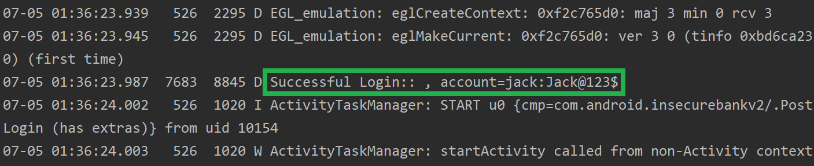
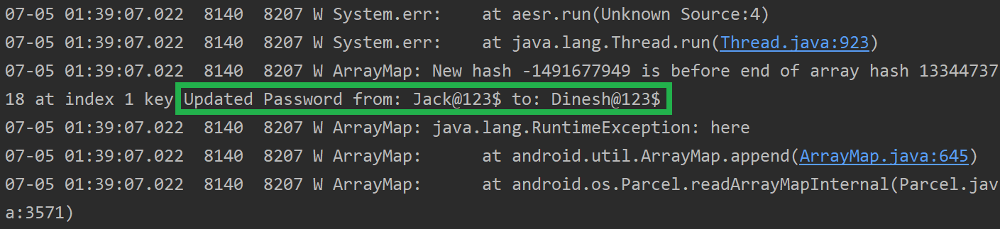

# Insecure Logging mechanism

### 1. 实验过程

- 查看 APP 运行期间的日志消息

    ```
    C:> adb logcat
    ```

- 尝试所有登陆行为，发现如下事件会披露用户的`(Account, Password)`

    - Login

        

    - Change password

        

    - Unauthorized access to personal device(s)

        

### 2. 参考资料

- [Logcat 命令行工具 | Android Developers](https://developer.android.com/studio/command-line/logcat)

- [Something about Phone number of Android Emulator | StackOverflow](https://stackoverflow.com/questions/47250498/1555521-is-added-as-a-prefix-to-short-numbers)