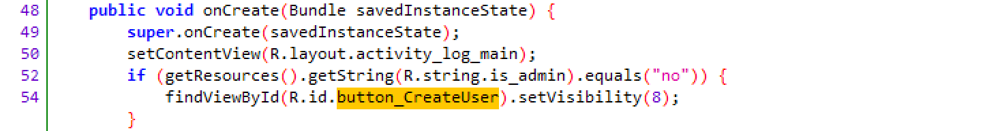
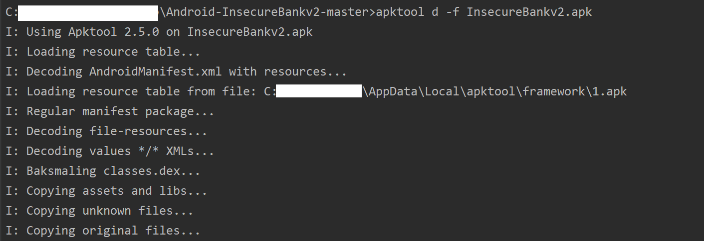
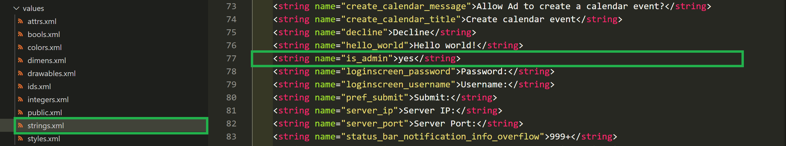
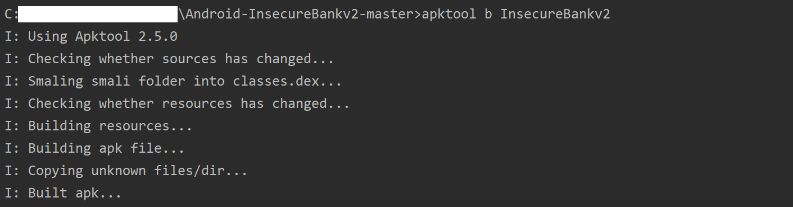

# Android Application Patching + Weak Auth

### 1. 实验过程

- **缺陷代码定位**

    - 使用 JADX-GUI 打开 `InsecureBankv2.apk` (Decompile)

    - 由于实验目标是 `找到创建用户的隐藏按钮`，因此将缺陷代码搜索范围缩小到 `DoLogin` 以及 `LoginActivity`，并最终在 `LoginActivity` 定位如下代码：

        

    - 由以上代码可确定如下破解思路：

        - 将 `R.string.is_admin` 的值修改为 `yes`

        - 向 setVisibility 传入 `0`

            > public void setVisibility (int visibility)
            > // **int**: One of VISIBLE, INVISIBLE, or GONE. Value is VISIBLE, INVISIBLE, or GONE*
            > // VISIBLE: Constant Value: 0 (0x00000000)
            > // INVISIBLE: Constant Value: 4 (0x00000004)
            > // GONE: Constant Value: 8 (0x00000008)

- **漏洞利用**

    - ***Method_1** - 修改is_admin的值*

        - 使用 apktool 反编译 `InsecureBankv2.apk`

            ```
            # 切换至 Project 目录下
            C:> apktool d InsecureBankv2.apk
            ```

            

        - 在 `InsecureBankv2/res/values/strings.xml` 中给 `is_admin` 赋一个不是 `no` 的值

            

    - ***Method_2** - 修改传入参数*

        - 将打开的 Project 另存

        - 修改源代码如下：

            ```
            # [ORIGINAL] findViewById(R.id.button_CreateUser).setVisibility(8);
            findViewById(R.id.button_CreateUser).setVisibility(0);
            ```

    - 重新编译 InsecureBankv2

        ```
        C:> apktool b InsecureBankv2
        ```

        

    - 重签名

        ```
        C:\> cd InsecureBankv2/dist/
        C:> <Android SDK Path>/build-tools/<valid version code>/apksigner sign --min-sdk-version 19 --ks <path to release.keystore.jks> --out InsecureBankv2-signed.apk InsecureBankv2.apk
        ```

    - **漏洞利用效果展示**

        

### 2. 参考资料

- [android:visibility | Android Developers](https://developer.android.com/reference/android/view/View#attr_android:visibility)