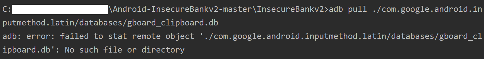

# Exploit Android Keyboard Cache

### 1. 实验过程

- **将常用词添加到 Personal Dictionary**

    - 进入 `Settings` -> `System` -> `Languages & inputs` -> `Advanced` -> `Personal dictionary` -> `Add(+) button`，然后编辑个人用户字典

        

        

- **Gboard 缓存数据库定位**

    - 由于本模拟器中的键盘缓存的路径与 Walkthroughs 中不同，因此在 Shell
     -> `/data/data/` 中查找一下可能的缓存路径（ `grep` 真的太万能了…谁i了？）

        ```
        # grep 'cache' -R .
        ```

        

    - 将数据库文件下载到本地

        ```
        C:> adb pull /data/data/com.google.android.inputmethod.latin/databases/gboard_clipboard.db LOCAL_PATH
        ```

    - 使用 SQLite查看数据库内容

        ```
        # 打开 SQLite shell
        C:> sqlit3 DB_PATH
        
        # [SHELL]
        # 查看数据库内所有表名
        sqlite> .tables
        # 表查询
        sqlite> select * from TABLE_NAME;
        ```

- **漏洞利用效果展示**

    

    **！！但是这有个大问题！！** —— 上图并不是我在 emulator 中保存的用户偏好字典中的内容，而是我本机键盘的 cache，这究竟是 BUG 还是我的database 定位不准确？

### 2. 遇到的问题

- adb pull failed

    

    **错误原因：** 

    > Files and directories below /data/data are protected from the "average user", so you cannot simply "pull" them unless the ADB daemon is running in root mode. Other than the file you were referring to (/system/buildprop is at least readable by all apps), folders below /data/data are "invisible" (except for root), so they cannot even be read.

    **解决方法：**

    > To be able to use adb pull on them, you need to make your ADB daemon run in root mode first. Depending on the device, a simple adb root command might do that – but most devices will refuse to do. In those cases, you can use chainfire's adbd insecure: Install this app on your device, start it there, and manually switch to "insecure" mode. Now the pull should succeed.
    >
    > Remark: It's called "insecure" because running adbd as root gives everybody with a computer and an USB cable access to everything on your device. Just in case you wonder.

    运行如下指令提权：

    ```
    C:> adb root
    ```

- `adb pull` 得到的是本机键盘的 cache ……，求解答qwq

### 3. 参考资料

- [How to add words to the internal dictionary on your Android device, and add shortcuts for longer words](https://www.businessinsider.com/how-to-add-words-to-android-dictionary?international=true&r=US&IR=T)

- [adb pull /data fails | Android Enthusiasts](https://android.stackexchange.com/questions/75510/adb-pull-data-fails)

- [View Android keyboard cache](https://stackoverflow.com/questions/45739485/view-android-keyboard-cache)

- [Open DB File](https://opendbfile.com/)

- [SQLite Show Tables | SQLITE TUTORIAL](https://www.sqlitetutorial.net/sqlite-tutorial/sqlite-show-tables/)