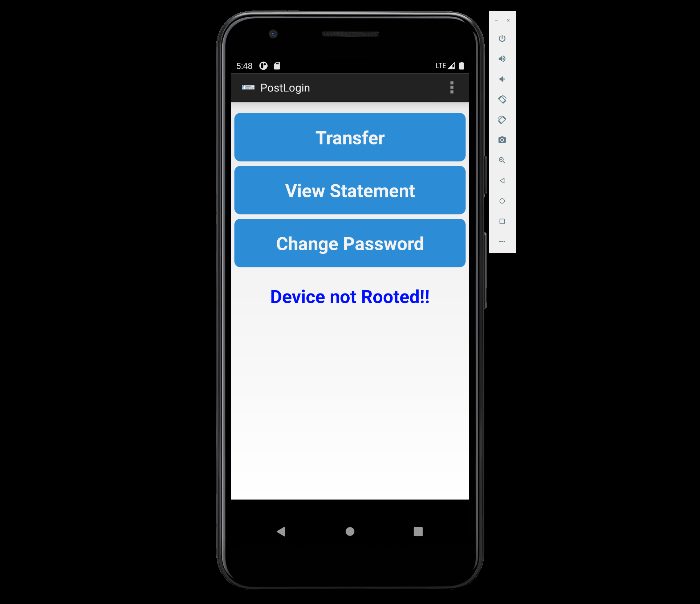
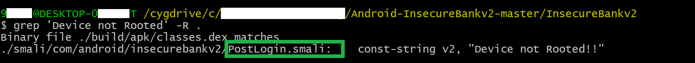

# Exploiting Android Activities

### 1. 实验过程

- **Activity 定位**

    - 使用 apktool 反编译 `InsecureBankv2.apk`

        ```
        C:> apktool d InsecureBankv2.apk
        ```

    - 根据用户登陆行为，在反编译 Project 中定位 用户登录后的 Activity

        ```
        $ grep 'Device not Rooted' -R .
        ```

        

        

- **漏洞利用效果展示**

    