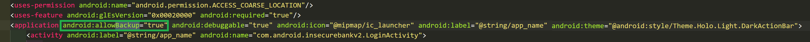
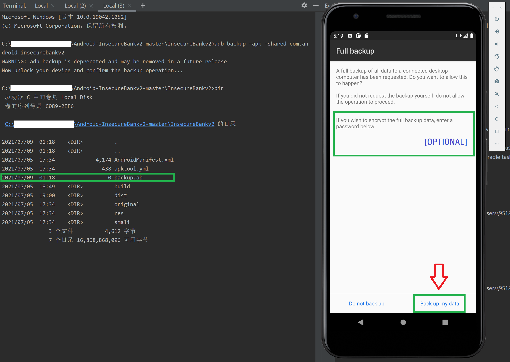
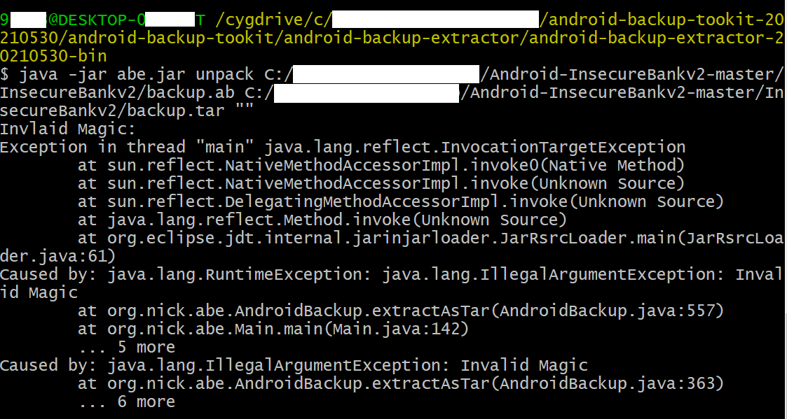
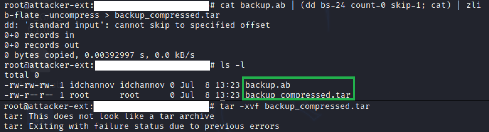
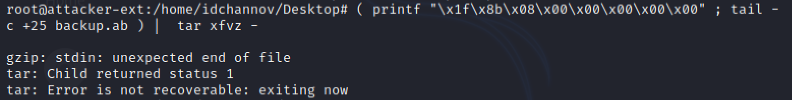

# Exploiting Android Backup Functionality

### 1. 实验过程

- 在 `AndroidManifest.xml` 中找到数据备份声明

    

- 使用 (Account, Password) 登录

    

- 对 InsecureBankv2 进行备份

    ```
    C:> adb backup –apk –shared com.android.insecurebankv2
    ```

    

- 将备份文件转化为可读样式如下：

    ```
    $ cat backup.ab | (dd bs=24 count=0 skip=1; cat) | zlib-flate -uncompress > backup_compressed.tar
    ```

    

### 2. 遇到的问题

- **【UNSOLVED】** 成功备份但无法将 .ab 文件转化为可读样式

    尝试过如下方法：

    

    

    

### 3. 参考资料

- [数据备份概览 | Android Developers](https://developer.android.com/guide/topics/data/backup)