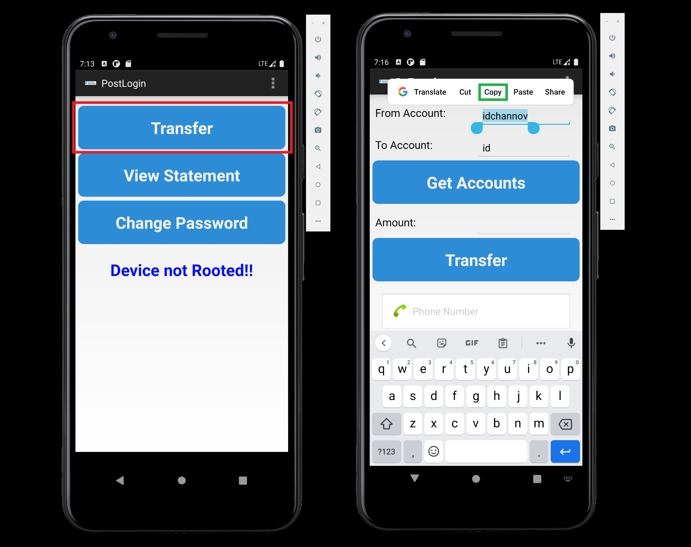
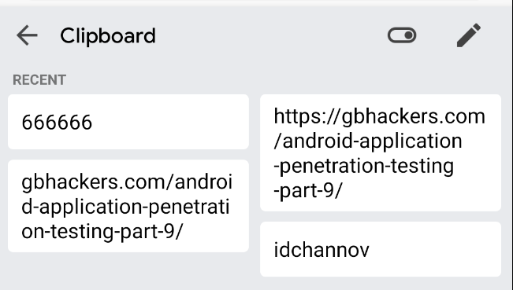

# Exploiting Android Pasteboard

### 1. 实验过程

- 使用 `(Account, Password)` 登录 -> 点击 `Transfer` -> 复制任意一段文本

    

- 查找应用进程信息

    ```
    C:> adb shell ps | grep insecure
    ```

    

- 查看剪贴板文本信息

    ```
    $ su PID service call clipboard 2 s16 APK_NAME
    ```

    

### 2. 遇到的问题

- 剪贴板文本信息为空？不清楚是什么问题……

    

### 2. 参考资料

- [Android Application Penetration Testing – Part 9](https://gbhackers.com/android-application-penetration-testing-part-9/)