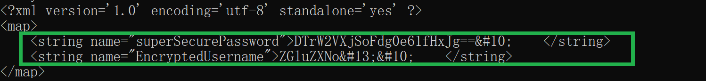
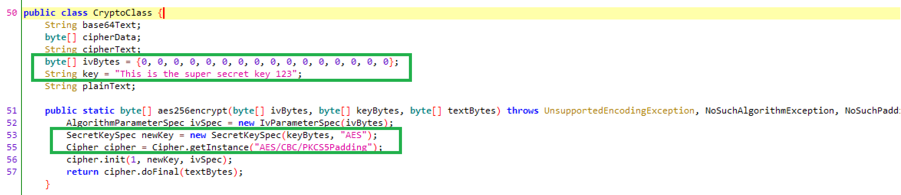
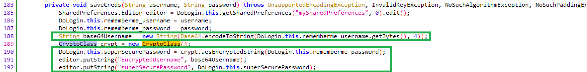
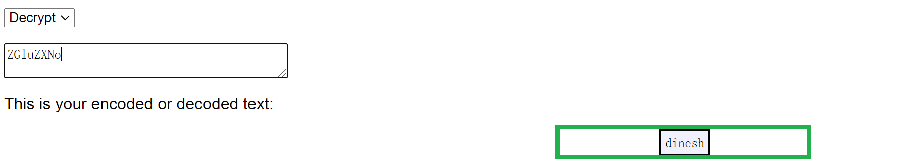
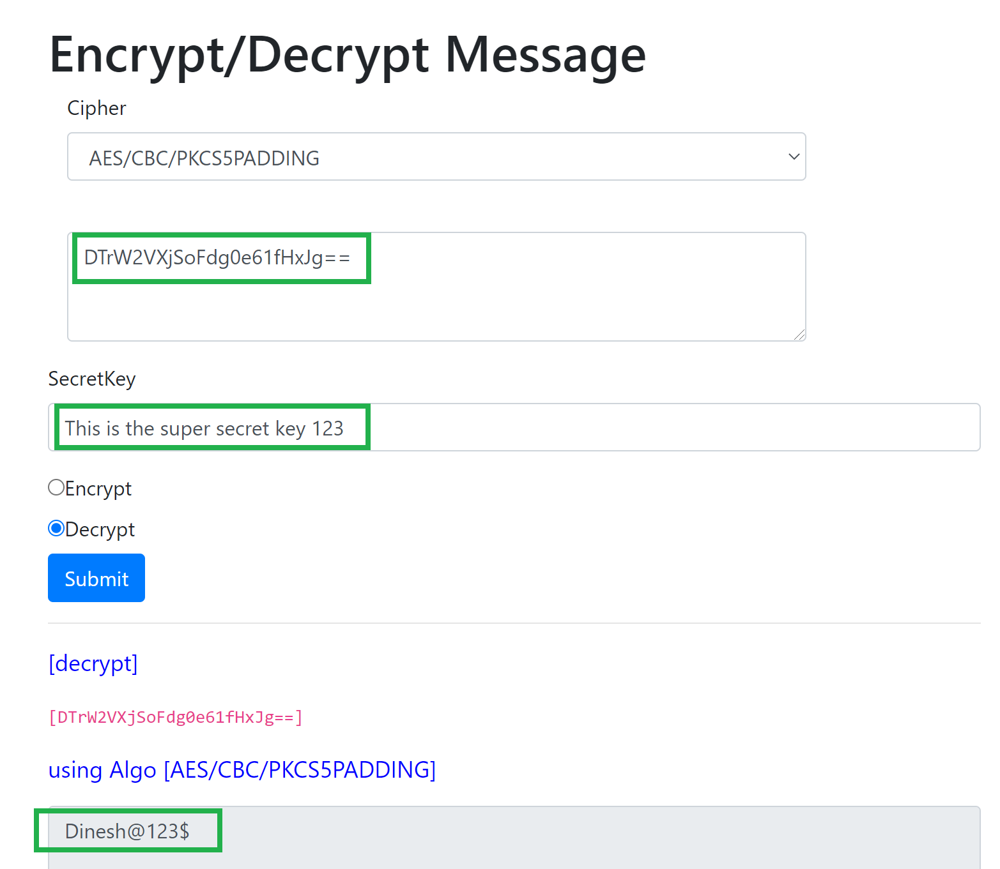
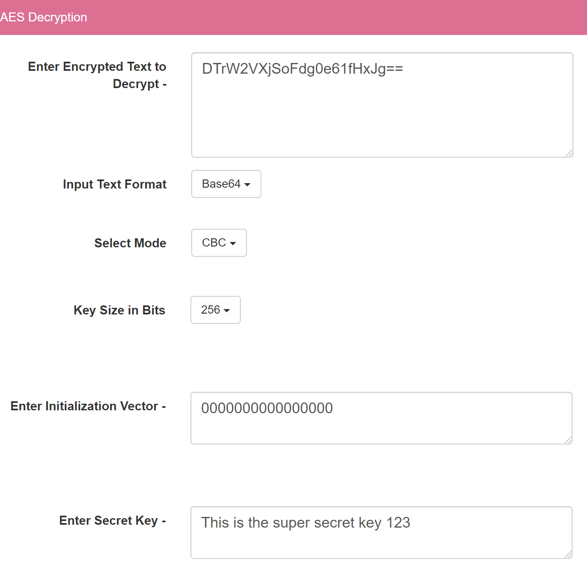

# Exploiting Weak Cryptography

### 1. 实验过程

- **寻找加密存储的 (Account, Password)**

    - Login with `(Account, Password)`

    - 在 Shell 中切换目录至应用沙盒

        ```
        $ cd /data/data/com.android.insecurebankv2/shared_prefs/
        ```
    
    - 在 `mySharedPreferences.xml` 中找到加密存储的 `(Account, Password)`

        

- **加密信息寻找**

    - 通过使用 JADX-GUI 反编译 `InsecureBankv2.apk`，并找到加密代码

        - `CryptoClass`

            

        - `DoLogin`

            

    - 由以上代码可知：

        - Username：`base64` encoded
        
            *(Decode via [Online Tool](http://rumkin.com/tools/cipher/base64.php))

            

        - Password：`AES / CRC` encoded

            *(Decode via [Online Tool](https://8gwifi.org/CipherFunctions.jsp))

            


### 2. 遇到的问题

- **【Unsolved】** 在多个Online Decryption Website 使用 `DES / CRC解密功能` 时遇到如下报错信息：

    ```
    Given final block not properly padded. Such issues can arise if a bad key is used during decryption.
    ```

    **解密配置描述：**

    

    **可能导致错误的原因：** 工作模式选择（without PKCS5Padding）

### 3. 参考资料

- [移动互联网安全（2021）- CUCSec (Prod by. Hwang)](https://b23.tv/l8tfPP)