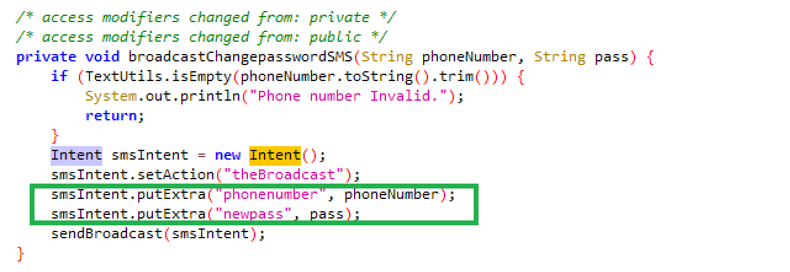

# Intent Sniffing

### 1. 实验过程

- **缺陷代码定位**

    - 使用 apktool 反编译 `InsecureBankv2.apk`

        ```
        C:> apktool d InsecureBankv2.apk
        ```

    - 在 `AndroidManifest.xml` 中找到广播接收器声明

        

    - 在反编译 Project 下搜索 `theBroadcast`，找到响应 action 的活动，并在 `ChangePassword` 中找到关键字 `(phonenumber, newpass)`

        ```
        $ grep 'theBroadcast' -R .
        ```

        

        

    - 继续在反编译 Project 中搜索上述关键词，并在 `MyBroadcastReceiver` 中定位传参的关键代码

        ```
        $ grep 'MyBroadcastReceiver' -R .
        ```

        

        

- **Intent 嗅探**

    - 在模拟器上安装 SniffIntents (Path: `InsecureBankv2/wip-attackercode/SniffIntents`)

        

    - Login with `(Account, Password)`

    - `Change Password` 后切换到 SniffIntents 界面

        