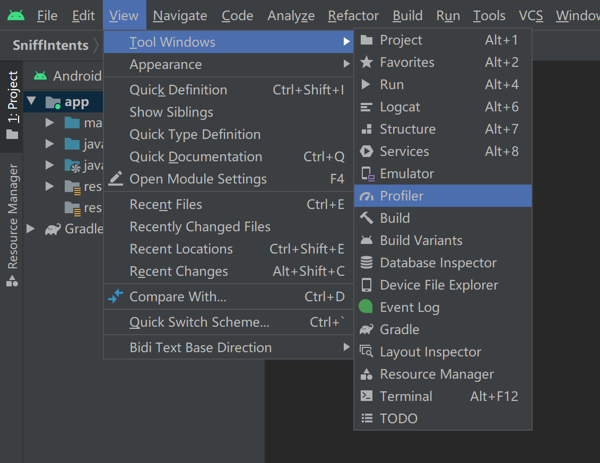
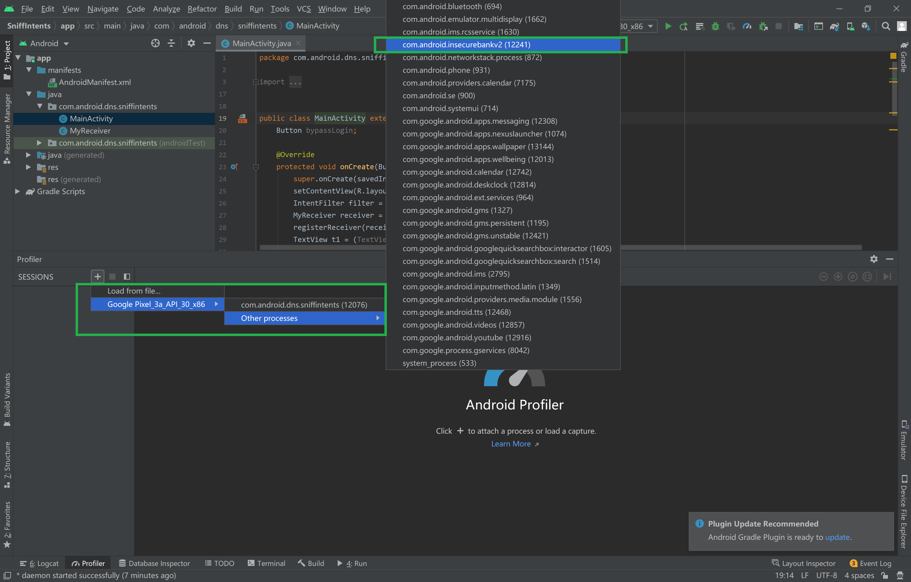
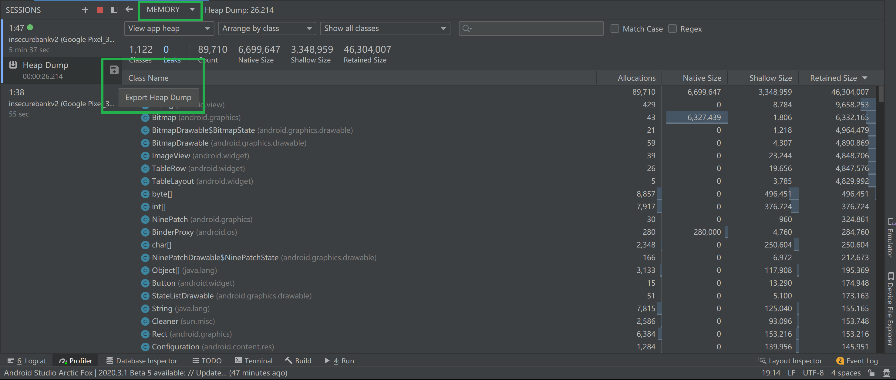
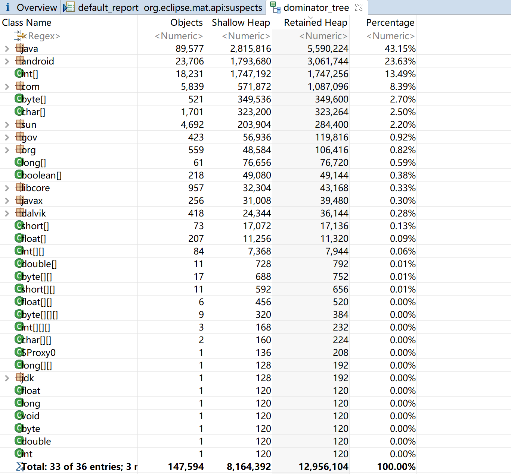
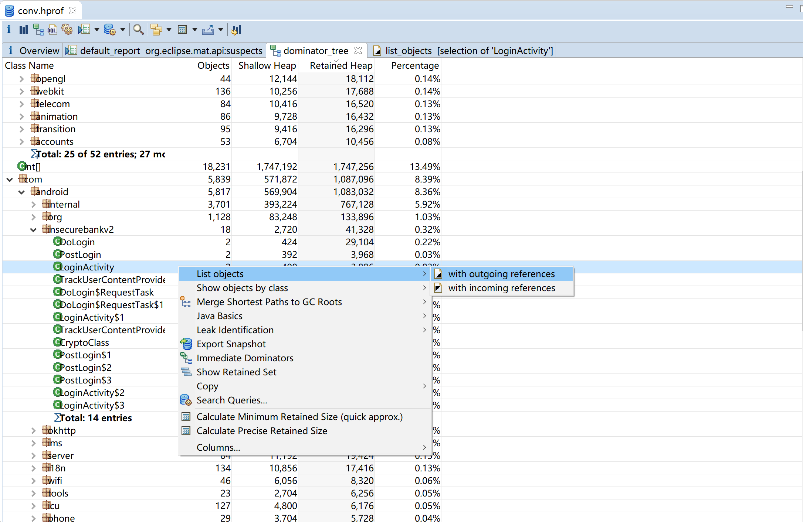
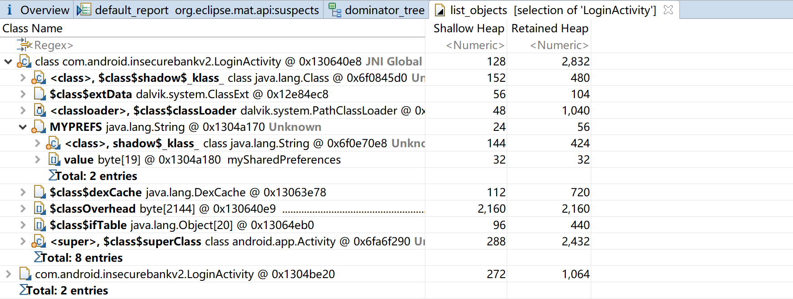
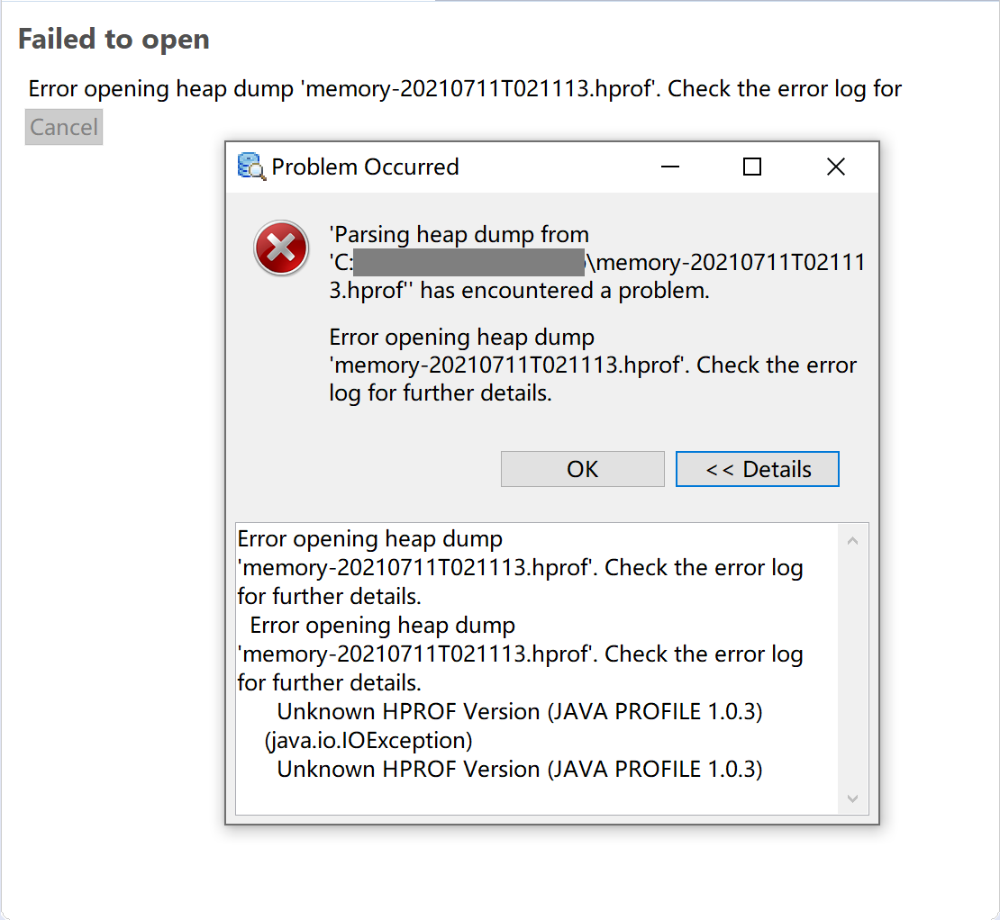
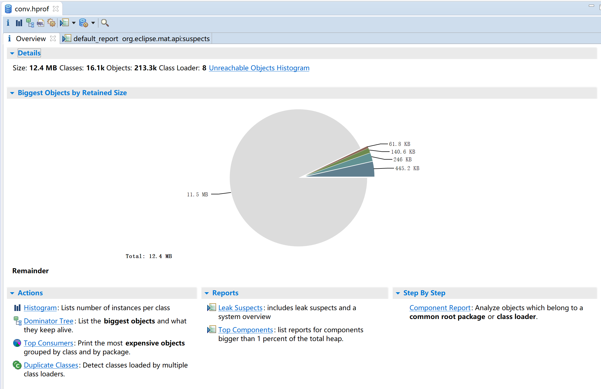

# Reading Android Memory

### 1. 实验过程

- **捕获堆转储**

    - 重置 ADB Shell

        ```
        C:> adb kill-server
        C:> adb start-server
        ```

    - 使用 Profiler 捕获应用运行期间的内存信息，并将堆转储另存为 `.hprof` 文件

        

        

        

    - `.hprof` 文件格式转换

        ```
        C:> hprof-conf [-z] IN_FILE OUT_FILE
        ```

- **内存读取**

    - 点击  ->  -> `Group by Package` 进入如下界面

        

    - 在 com.android.insecurebankv2 中随便找一个 class，`右键单击` -> `List objects` -> `with outgoing references`

        

        （然后就可以看到应用运行期间的内存信息啦！虽然看不懂但还是觉得好神奇yo！🤗希望以后有机会可以用到~

        

### 2. 遇到的问题

- 使用 Memory Analyser 分析堆转储文件时报错如下：

    

    **错误原因：** 使用其他 HPROF 分析器（Android Studio 其实自带了一种 Memory Analyser）时需要将 HPROF 文件从 Android 格式转换为 Java SE HPROF 格式：

    ```
    C:> hprof-conf [-z] IN_FILE OUT_FILE
    ```

    **结果展示：**

    

### 3. 参考资料

- [使用内存性能分析器查看应用的内存使用情况 | Android Developers](https://developer.android.com/studio/profile/memory-profiler#save-hprof)